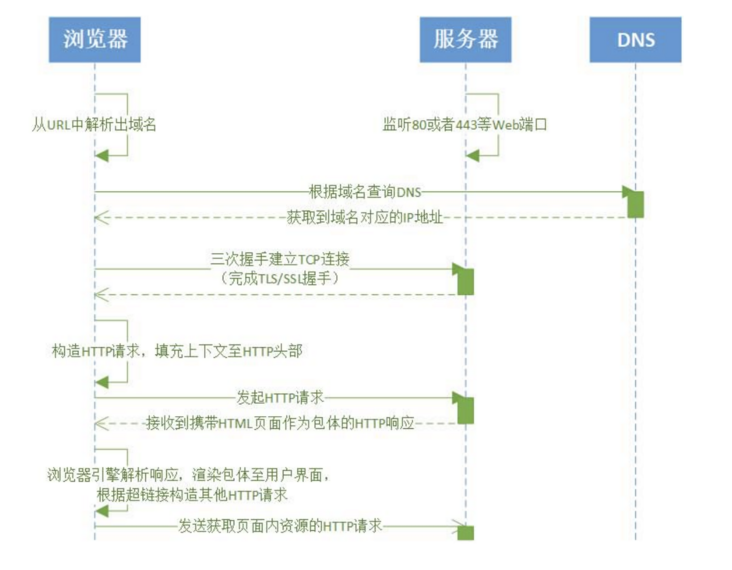

# 《Web 协议详解与抓包实战》学习笔记 Day 1

### HTTP 协议定义

a stateless application-level request/response protocol that uses extensible semantics and self-descriptive message payloads for flexible interaction with network-based hypertext information system.

一种无状态的、应用层的、以请求 / 应答方式运行的协议，它使用可扩展的语义和自描述消息格式，与基于网络的超文本信息系统灵活地互动。

参考链接：[https://tools.ietf.org/html/rfc7230](https://tools.ietf.org/html/rfc7230)

#### 浏览器发起 HTTP 请求的典型场景


### HTTP 消息的格式

巴科斯范式的英文缩写为 BNF，它是以美国人巴科斯 (Backus) 和丹麦人诺尔 (Naur) 的名字命名的一种形式化的语法表示方法，用来描述语法的一种形式体系，是一种典型的元语言。又称巴科斯 - 诺尔形式 (Backus-Naur form)。它不仅能严格地表示语法规则，而且所描述的语法是与上下文无关的。它具有语法简单，表示明确，便于语法分析和编译的特点。

ABNF(Augmented BNF) 官方文档：[https://www.ietf.org/rfc/rfc5234.txt](https://www.ietf.org/rfc/rfc5234.txt)

#### ABNF 操作符

* 空白字符：用来分隔定义中的各个元素
* method SP request-target SP HTTP-version CRLF
* 选择 `/`：表示多个规则都是可供选择的规则
* start-line = request-line / status-line
* 值范围 `%c##-##`：OCTAL = “0” / “1” / “2” / “3” / “4” / “5” / “6” / “7” 与 OCTAL = %x30-37 等价
* 序列组合 `()`：将规则组合起来，视为单个元素
* 不定量重复 `m*n`：1. `*` 元素表示零个或更多元素： *( header-field CRLF ) 2. `1*` 元素表示一个或更多元素，`2*4` 元素表示两个至四个元素
* 可选序列 []：[ message-body ]

#### ABNF 核心规则

|规则|形式定义| 意义                                            |
|-----|-------|-----------------------------------------------|
|ALPHA|%x41-5A / %x61-7A | 大写和小写ASCII字母（A-Z, a-z）                        |
|DIGIT |%x30-39| 数字（0-9）                                       |
|HEXDIG |DIGIT / "A" / "B" / "C" / "D" / "E" / "F" | 十六进制数字（0-9, A-F, a-f）                         |
|DQUOTE |%x22 | 双引号                                           |
|SP |%x20 | 空格                                            |
|HTAB| %x09 | 横向制表符                                         |
|WSP |SP / HTAB | 空格或横向制表符                                      |
|LWSP |*(WSP / CRLF WSP) | 直线空白（晚于换行）                                    |
|VCHAR |%x21-7E | 可见（打印）字符                                      |
|CHAR| %x01-7F | 任何7-位US-ASCII字符，不包括NUL（%x00）OCTET %x00-FF 8位数据 |
|CTL| %x00-1F / %x7F | 控制字符                                          |
|CR |%x0D | 回车                                            |
|LF |%x0A | 换行                                            |
|CRLF |CR LF | 互联网标准换行                                       |
|BIT |"0" / "1" | 二进制数字                                         |

#### 基于 ABNF 描述的 HTTP 协议格式

HTTP-message = `start-line` *(`header-field` CRLF ) CRLF [ message-body ]
* `start-line` = request-line / status-line
* request-line = method SP request-target SP HTTP-version CRLF
* status-line = HTTP-version SP status-code SP reason-phrase CRLF
* `header-field` = field-name ":" OWS field-value OWS
* OWS = *( SP / HTAB ) • field-name = token
* field-value = *( field-content / obs-fold )
* message-body = *OCTET

### macOS 系统安装 telnet 工具

打开终端，先通过以下命令安装 [Homebrew](https://brew.sh/index_zh-cn)
```
/bin/bash -c "$(curl -fsSL https://raw.githubusercontent.com/Homebrew/install/HEAD/install.sh)"
```
安装完 Homebrew 之后，运行 `brew install telnet` 安装 telnet 工具

#### 在 macOS 系统下运行 telnet 命令

先输入：`telnet www.baidu.com 80`，按回车键后会出现：
```
Trying 36.152.44.96...
Connected to www.a.shifen.com.
Escape character is '^]'.
```
然后再输入：`GET /duty/baozhang.html HTTP/1.1`
回车后继续输入：`HOST:www.baidu.com`
输入完毕后，按两次回车即可。

> [陶辉博客](https://www.taohui.pub/)  
> [课程链接《Web 协议详解与抓包实战》极客时间](http://gk.link/a/11UWp)
