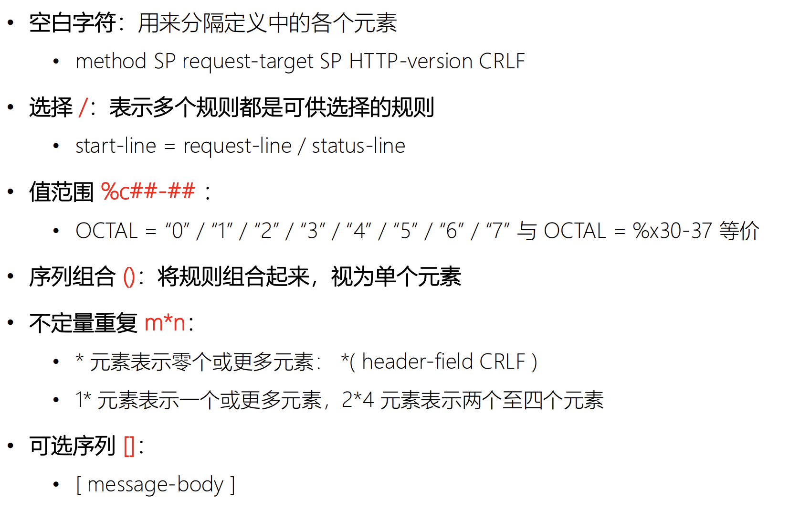
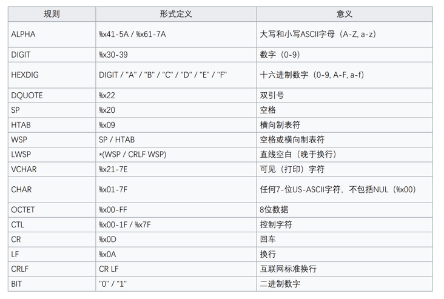
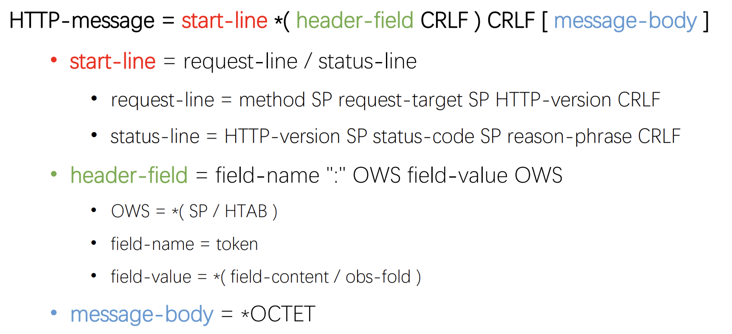

# 《Web 协议详解与抓包实战》学习笔记 Day 1

#### HTTP 协议定义

a stateless application-level request/response protocol that uses extensible semantics and self-descriptive message payloads for flexible interaction with network-based hypertext information system.

一种无状态的、应用层的、以请求 / 应答方式运行的协议，它使用可扩展的语义和自描述消息格式，与基于网络的超文本信息系统灵活地互动。

参考链接：[https://tools.ietf.org/html/rfc7230](https://tools.ietf.org/html/rfc7230)

#### 浏览器发起 HTTP 请求的典型场景

#### HTTP 消息的格式

##### ABNF 操作符

##### ABNF 核心规则

##### 基于 ABNF 描述的 HTTP 协议格式

