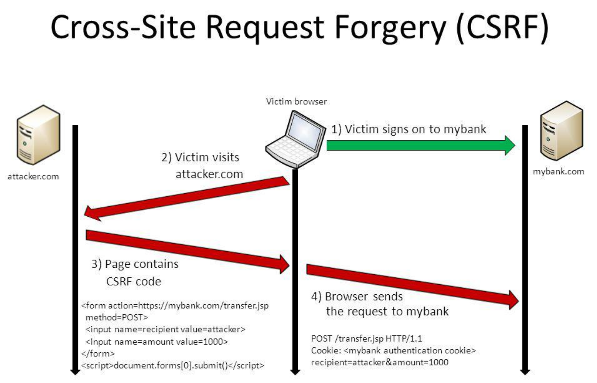
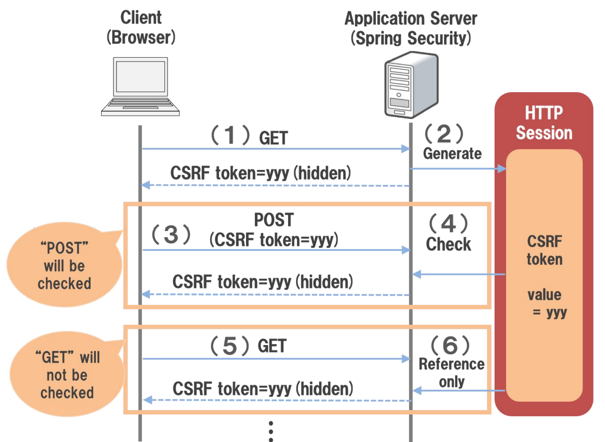

# 《Web 协议详解与抓包实战》学习笔记 Day 11

## 为什么需要同源策略？

同一个浏览器发出的请求，未必都是用户自愿发出的请求

只有 page.html 是用户发出的，其他请求是浏览器自动发出的

## 为什么需要同源策略？ 

站点 domain-b.com 收到的来自同一浏览器的请求，可能来自于站点domain-a.com

## 没有同源策略下的 Cookie 

只能保证用户请求来自于同一浏览器，不能确 保是用户自愿发出的

  - 访问站点 A 后，站点 A 通过 Set-Cookie： Cookie 头部将 Cookie 返回给浏览器
  - 浏览器会保存 Cookie，留待下次访问
  - 站点 B 的脚本访问站点 A 时，浏览器会自 动将 Cookie: cookie 添加到请求的头部访问 站点 A，提升用户体验
  -  站点 A 的鉴权策略：取出 Cookie 值与数据 库或者缓存中的 token 验证，通过后将数据 赋予请求继续处理。

## 如果没有同源策略

站点 B 的脚本就可以随意修改站点 A 的 DOM 结构

## 浏览器的同源策略

限制了从同一个源加载的文档或脚本如何与来自另一个源的资源进行交互

## 安全性与可用性需要一个平衡点

* 可用性：HTML 的创作者决定跨域请求是否对本站点安全
  - `<script><iframe><link><video><audio>` 带有 src 属性可以跨域访问
  - 允许跨域写操作：例如表单提交或者重定向请求
* CSRF安全性问题 安全性：浏览器需要防止站点 A 的脚本向站点 B 发起危险动作
  - Cookie、LocalStorage 和 IndexDB 无法读取
  - DOM 无法获得（防止跨域脚本篡改 DOM 结构）
  - AJAX 请求不能发送

## 跨站请求伪造攻击

## CSRF 的一种防攻击方式

## CORS：Cross-Origin Resource Sharing

* 浏览器同源策略下的跨域访问解决方案：
  - 如果站点 A 允许站点 B 的脚本访问其资源，必须在 HTTP 响应中显式的告知浏览器：站点 B 是被允 许的
    - 访问站点 A 的请求，浏览器应告知该请求来自站点 B
    - 站点 A 的响应中，应明确哪些跨域请求是被允许的
* 策略 1：何为简单请求？
  - GET/HEAD/POST 方法之一
  - 仅能使用 CORS 安全的头部：Accept、Accept-Language、Content-Language、Content-Type
  - Content-Type 值只能是： text/plain、multipart/form-data、application/x-www-form-urlencoded 三者其中之一
* 策略 2：简单请求以外的其他请求
  - 访问资源前，需要先发起 prefilght 预检请求（方法为 OPTIONS）询问何种请求是被允许的

## 简单请求的跨域访问

* 请求中携带 Origin 头部告知来自哪个域
* 响应中携带 Access-Control-Allow-Origin 头部表示允许哪些域
* 浏览器放行

## 预检请求

* 预检请求头部
  - Access-Control-Request-Method
  - Access-Control-Request-Headers
* 预检请求响应
  - Access-Control-Allow-Methods
  - Access-Control-Allow-Headers
  - Access-Control-Max-Age

## 跨域访问资源

* 请求头部
  - Origin（RFC6454）：一个页面的资源可能来自于多个域名，在 AJAX 等子请求中标明来 源于某个域名下的脚本，以通过服务器的安全校验
    - origin = "Origin:" OWS origin-list-or-null OWS
    - origin-list-or-null = %x6E %x75 %x6C %x6C / origin-list
    - origin-list = serialized-origin *( SP serialized-origin )
    - serialized-origin = scheme "://" host [ ":" port ]
  - Access-Control-Request-Method
    - 在 preflight 预检请求 (OPTIONS) 中，告知服务器接下来的请求会使用哪些方法
  - Access-Control-Request-Headers
    - 在 preflight 预检请求 (OPTIONS) 中，告知服务器接下来的请求会传递哪些头部
* 响应头部
  - Access-Control-Allow-Methods
    - 在 preflight 预检请求的响应中，告知客户端后续请求允许使用的方法
  - Access-Control-Allow-Headers
    - 在 preflight 预检请求的响应中，告知客户端后续请求允许携带的头部
  - Access-Control-Max-Age
    - 在 preflight 预检请求的响应中，告知客户端该响应的信息可以缓存多久
  - Access-Control-Expose-Headers
    - 告知浏览器哪些响应头部可以供客户端使用，默认情况下只有 Cache-Control、Content-Language、 Content-Type、Expires、Last-Modified、Pragma 可供使用
  - Access-Control-Allow-Origin
    - 告知浏览器允许哪些域访问当前资源，*表示允许所有域。为避免缓存错乱，响应中需要携带 Vary: Origin
  - Access-Control-Allow-Credentials
    - 告知浏览器是否可以将 Credentials 暴露给客户端使用，Credentials 包含 cookie、authorization 类头部、 TLS证书等。

> [课程链接《Web 协议详解与抓包实战》极客时间](http://gk.link/a/11UWp)
