# 《Web 协议详解与抓包实战》学习笔记 Day 12

## 条件请求的作用

### 资源 URI 与资源表述 Representation

* 资源 R 可被定义为随时间变化的函数 MR(t)
  - 静态资源：创建后任何时刻值都不变，例如指定版本号的库文件
  - 动态资源：其值随时间而频繁地变化，例如某新闻站点首页
* 优点
  - 提供了无需人为设定类型或者实现方式的情况下，同一资源多种不同来源的信息
  -  基于请求特性进行内容协商，使资源的渲染延迟绑定
  - 允许表述概念而不是具体的 Representation，故资源变化时不用修改所有链接

### Preconditon 条件请求

* 目的
  - 由客户端携带条件判断信息，而服务器预执行条件验证过程成功后，再返 回资源的表述
* 常见应用场景
  - 使缓存的更新更有效率（如 304 响应码使服务器不用传递包体）
  - 断点续传时对之前内容的验证
  - 当多个客户端并行修改同一资源时，防止某一客户端的更新被错误丢弃

### 强验证器与弱验证器的概念

* 验证器 validator：根据客户端请求中携带的相关头部，以及服务器资源 的信息，执行两端的资源验证
  - 强验证器：服务器上的资源表述只要有变动（例如版本更新或者元数据更 新），那么以旧的验证头部访问一定会导致验证不过
  - 弱验证器：服务器上资源变动时，允许一定程度上仍然可以验证通过（例 如一小段时间内仍然允许缓存有效）

### 验证器响应头部

* Etag 响应头部
  - 定义：
    - ETag = entity-tag
    - entity-tag = [ weak ] opaque-tag
    - weak = %x57.2F
    - opaque-tag = DQUOTE *etagc DQUOTE
    - etagc = %x21 / %x23-7E / obs-text
  - 给出当前资源表述的标签
  - 例如：
    - 强验证器 ETag: "xyzzy"
    - 弱验证器 ETag: W/"xyzzy"
* Last-Modified 响应头部
  - 定义：Last-Modified = HTTP-date
  - 表示对应资源表述的上次修改时间
  - 对比 Date 头部： Date = HTTP-date
    - 表示响应包体生成的时间
    - Last-Modified 不能晚于 Date 的值

### 条件请求头部

* If-Match = "*" / 1#entity-tag
* If-None-Match = "*" / 1#entity-tag
* If-Modified-Since = HTTP-date
* If-Unmodified-Since = HTTP-date
* If-Range = entity-tag / HTTP-date

### 缓存更新

* 首次缓存
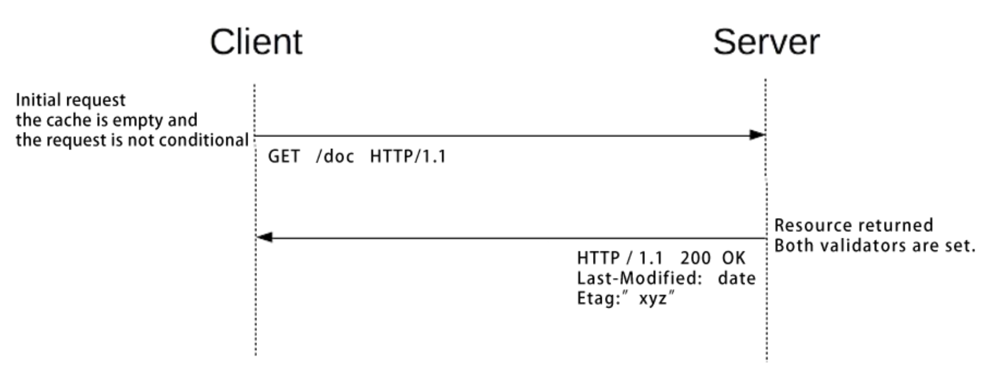
* 基于过期缓存发起条件请求
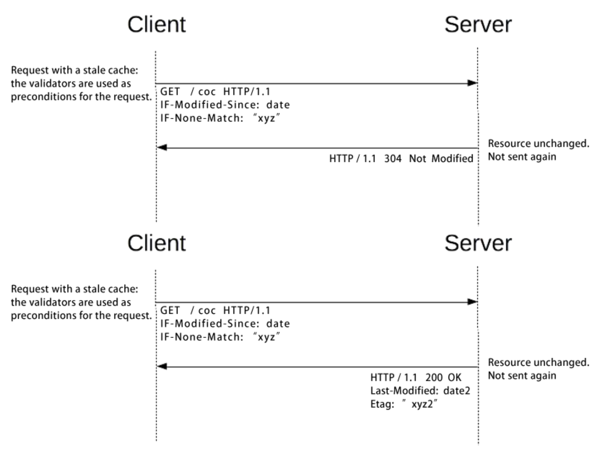

### 增量更新

* 当服务器支持 Range服务时，连接意外中断时已接收到部分数据
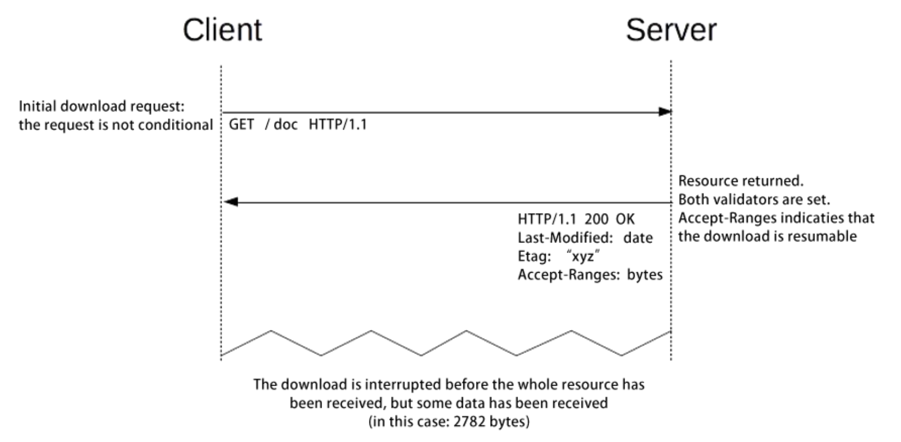
* 通过 Range 请求下载其他包体时，加入验证器防止两次下载间资源已发生了变更
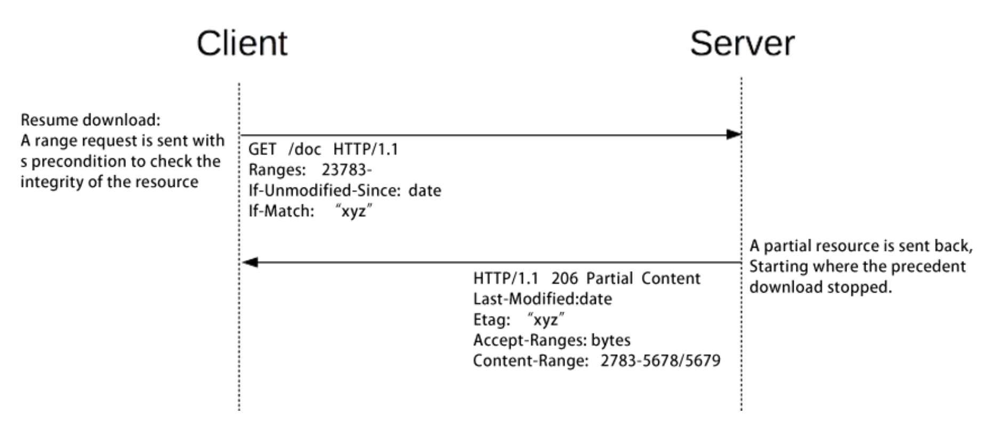
* 如果两次下载操作中，资源已经变量，则服务器用 412 通知客户端，而客 户端重新下载完整包体
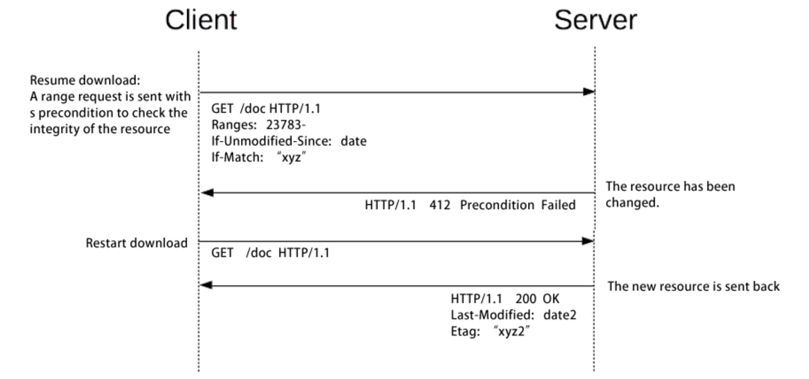
* 通过 If-Range 头部可以避免 2 次请求交互带来的损耗
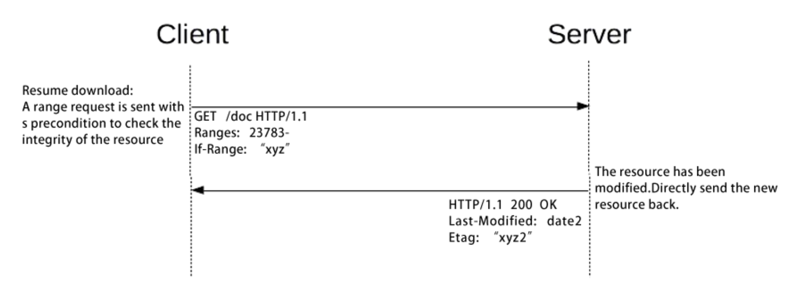

### 更新丢失问题

* 更新资源意味着 2 步操作：先获取资源，再把本地修改后的资源提交
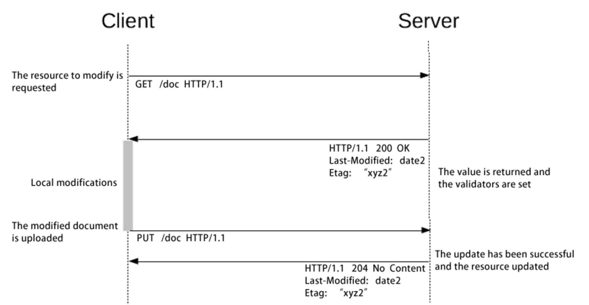
* 2 个客户端并发修改同一资源会导致更新丢失
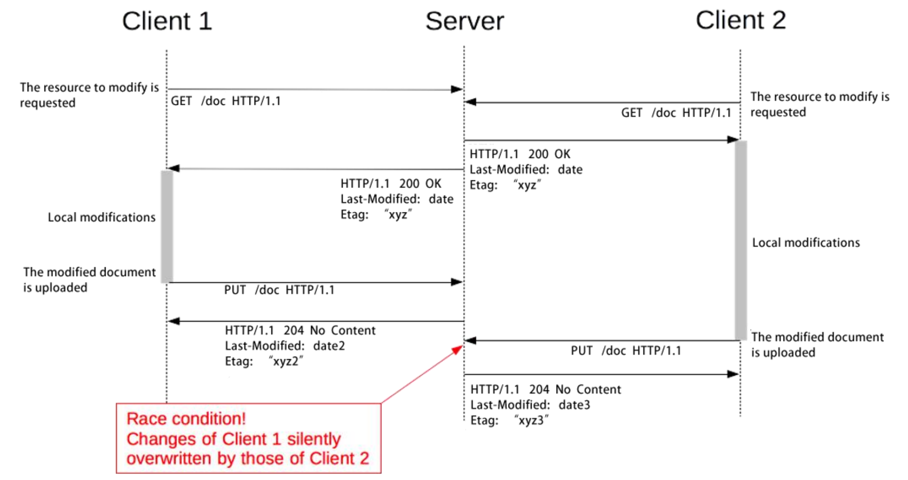
* 乐观锁：只允许第 1 个提交更新的客户端更新资源
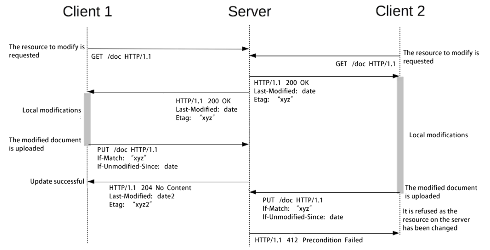
* 乐观锁解决首次上传
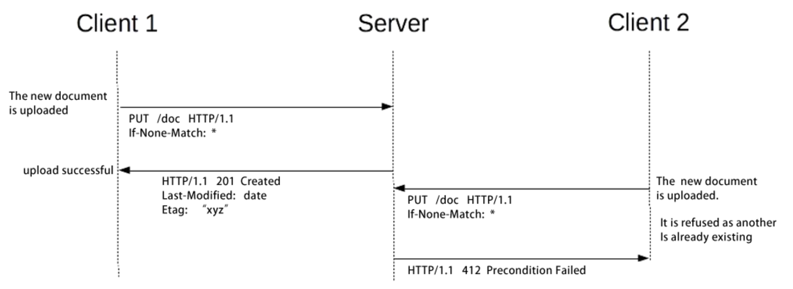

### 服务器处理条件请求的常见规则

* Nginx
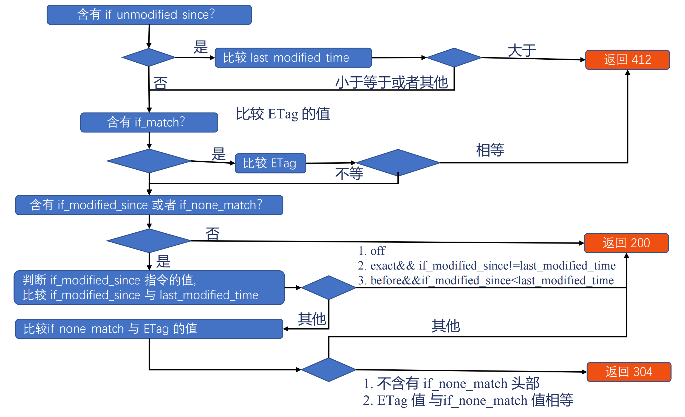

> [课程链接《Web 协议详解与抓包实战》极客时间](http://gk.link/a/11UWp)
