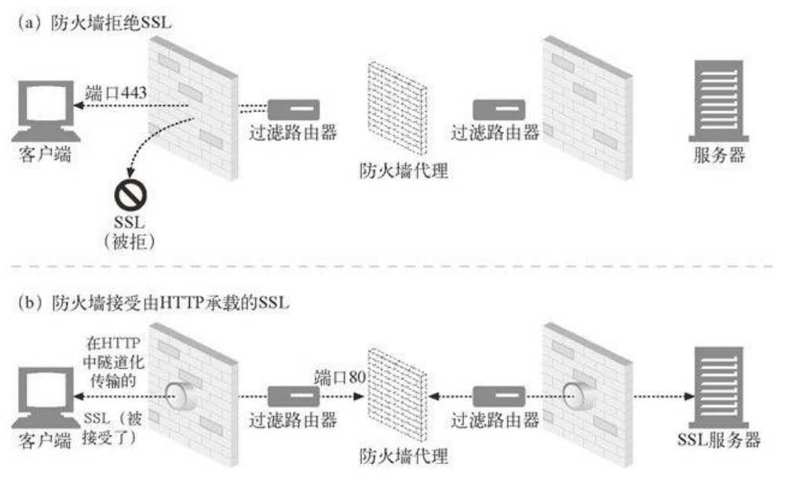
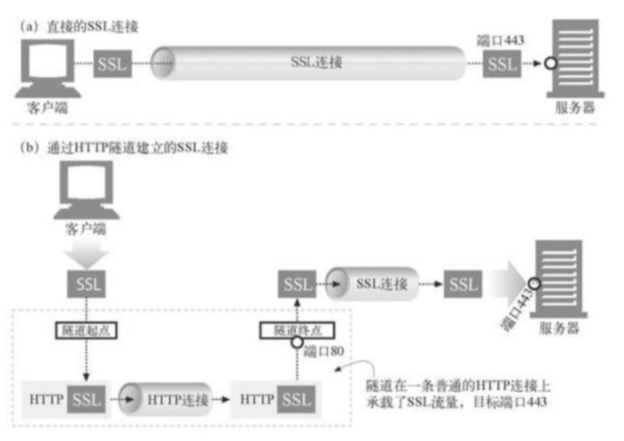
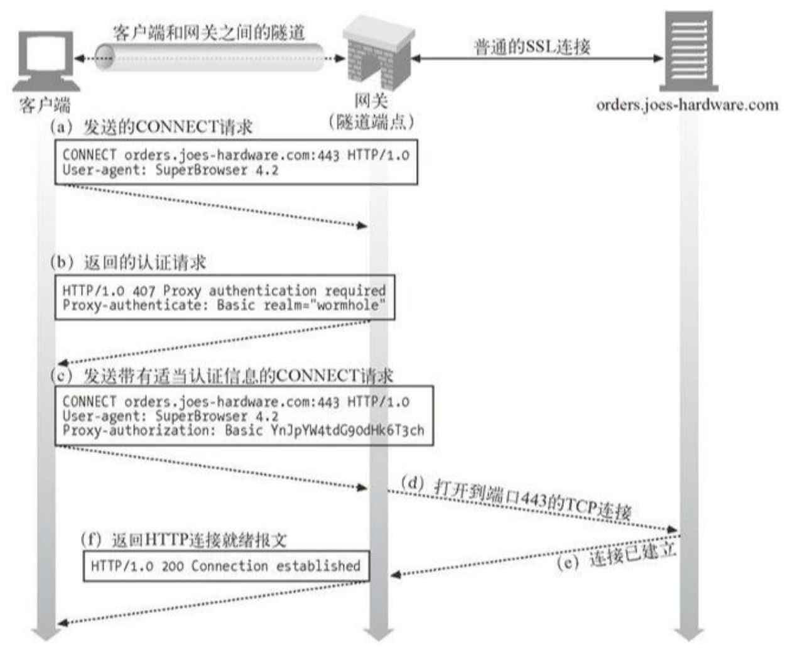

# 《Web 协议详解与抓包实战》学习笔记 Day 16

## 如何通过 HTTP 隧道访问被限制的网络

### Http Tunnel 隧道

* 用于通过 HTTP 连接传输非 HTTP 协议格式的消息，常用于穿越防火墙
* 建立隧道后，由于传输的并非 HTTP 消息，因此不再遵循请求/响应模式，已变为双向传输
* 请求行
  - request-line = method SP request-target SP HTTP-version CRLF
    - request-target = origin-form / absolute-form / authority-form / asterisk-form
      - origin-form = absolute-path [ "?" query ]
        - 向源服务器发起的请求，path 为空时必须传递 /
      - absolute-form = absolute-URI
        - 仅用于向正向代理 proxy 发起请求时，详见正向代理与隧道
      - authority-form = authority
        - authority = [ userinfo “@” ] host [ “:” port ]，指定源服务器
        - 仅用于 CONNECT 方法，例如 CONNECT www.example.com:80 HTTP/1.1
      - asterisk-form = "*"
        - 仅用于 OPTIONS 方法

### tunnel 隧道的常见用途：传递 SSL 消息

* 防火墙拒绝 SSL 流量怎么办？

* 代理服务器没有证书，如何转发 SSL 流量？

### Http Tunnel 隧道的认证

## 网络爬虫的工作原理与应对方式

### Web crawler：网络爬虫

* 网络爬虫模拟人类使用浏览器浏览、操作页面的行为，对互联网的站点进行操作
* 网络爬虫获取到一个页面后，会分析出页面里的所有 URI，沿着这些 URI 路径递归的遍历所有页面，因此被称为爬 虫（ Web crawler ）、蜘蛛（ Spider ）、网络机器人（spiderbot）

### 对待网络爬虫的 2 种态度

* 欢迎常光临
  - SEO（Search Engine Optimization），搜索引擎优化
    - "合法"的优化：sitemap、title、keywords、https 等
    - "非法"的优化：利用 PageRank 算法漏洞
* 拒绝访问
  - 为了对抗网络爬虫而生的图形验证码
  - 为了对抗图形验证码而生的"打码平台(captcha human bypass)"
  - 升级图形验证码：滑动拼图验证、文字点选验证、短信验证

### 网络爬虫如何抓取数据？

* 模拟浏览器渲染引擎，需要对 JavaScript 文件分析执行、发起 Ajax 请求等
* 爬虫爬取数据的速度 VS 互联网生成信息的速度
  - 爬虫执行速度快，许多爬虫可以并发执行
  - 互联网生成信息的速度远大于爬取速度
* 优先爬取更重要的页面（深度优先、广度优先）

### 爬虫常见的请求头部

* User-Agent：识别是哪类爬虫
* From：提供爬虫机器人管理者的邮箱地址
* Accept：告知服务器爬虫对哪些资源类型感兴趣
* Referer：相当于包含了当前请求的页面 URI

### robots.txt：告知爬虫哪些内容不应爬取

* Robots exclusion protocol：<http://www.robotstxt.org/orig.html>
* robots.txt 文件内容
  - User-agent：允许哪些机器人
  - Disallow：禁止访问特定目录
  - Crawl-delay：访问间隔秒数
  - Allow：抵消 Disallow 指令
  - Sitemap：指出站点地图的 URI

> [课程链接《Web 协议详解与抓包实战》极客时间](http://gk.link/a/11UWp)
