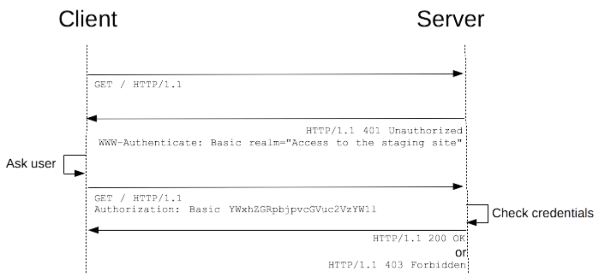

# 《Web 协议详解与抓包实战》学习笔记 Day 17

## HTTP 基本认证

* RFC7235，一种基本的验证框架，被绝大部分浏览器所支持
* 明文传输，如果不使用 TLS/SSL 传输则有安全问题

### 认证请求

* 在请求中传递认证信息：Authorization = credentials
  - credentials = auth-scheme [ 1*SP ( token68 / #auth-param ) ]
    - auth-scheme = token
    - token68 = 1*( ALPHA / DIGIT / "-" / "." / "_" / "~" / "+" / "/" ) *"=“
    - auth-param = token BWS "=" BWS ( token / quoted-string )
      - BWS = OWS
        - OWS = *( SP / HTAB )
  - 例如：authorization：Basic ZGQ6ZWU=
    - 实际 ZGQ6ZWU=是 dd:ee的 base64 编码，表示用户名和密码
* 由代理服务器认证：Proxy-Authorization = credentials

### 认证响应

* 在响应头部中告知客户端需要认证：WWW-Authenticate = 1#challenge
  - challenge = auth-scheme [ 1*SP ( token68 / #auth-param ) ]
    - auth-scheme = token
    - token68 = 1*( ALPHA / DIGIT / "-" / "." / "_" / "~" / "+" / "/" ) *"=“
    - auth-param = token BWS "=" BWS ( token / quoted-string )
      - BWS = OWS
        - OWS = *( SP / HTAB )
  - 例如：www_authenticate：Basic realm="test auth_basic"
* 由代理服务器认证：Proxy-Authenticate = 1#challenge
* 认证响应码
  - 由源服务器告诉客户端需要传递认证信息：401 Unauthorized
  - 由代理服务器认证： 407 Proxy Authentication Required
  - 认证失败：403 Forbidden

> [课程链接《Web 协议详解与抓包实战》极客时间](http://gk.link/a/11UWp)
