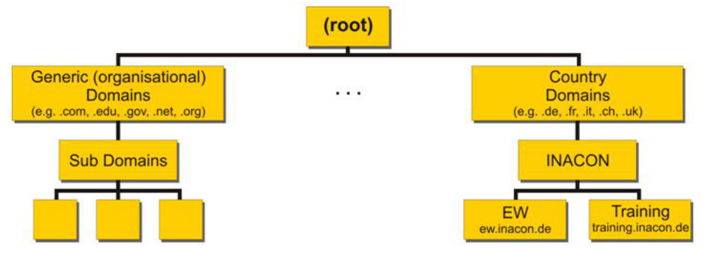
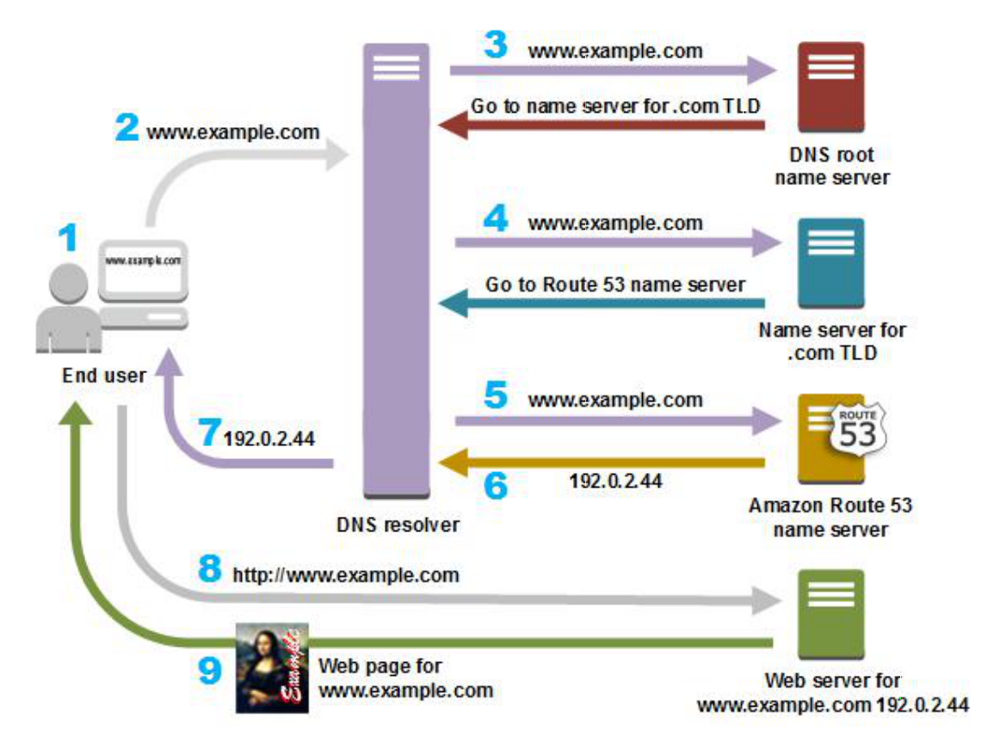
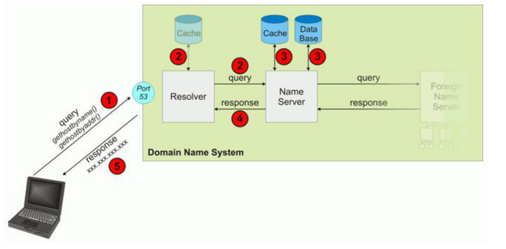
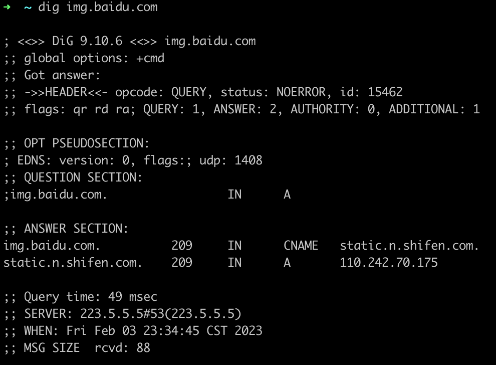
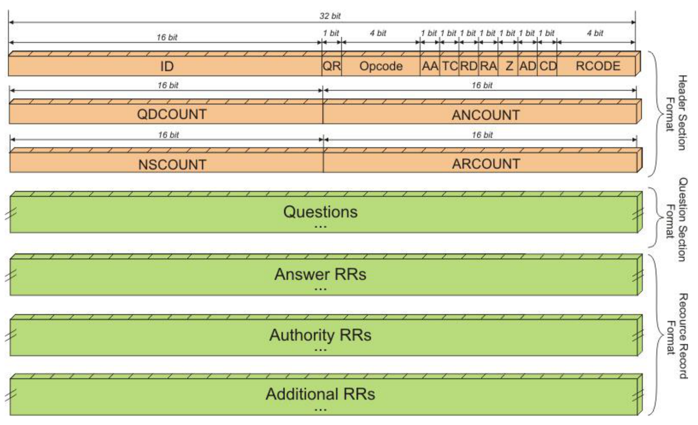
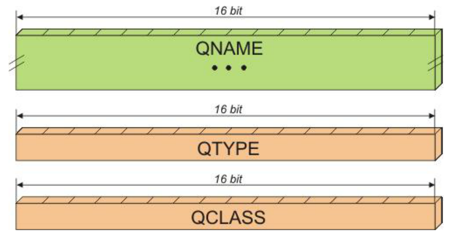
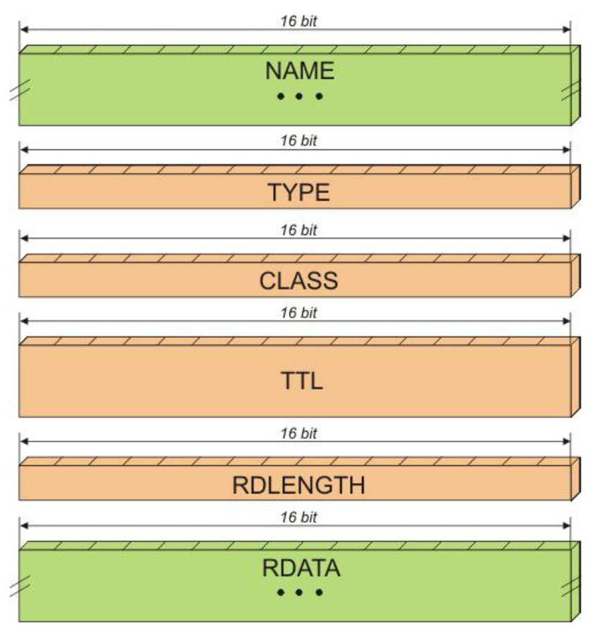

# 《Web 协议详解与抓包实战》学习笔记 Day 19

## 如何通过DNS协议解析域名？

### 什么是 DNS？

* 一个用于将人类可读的“域名”（例如 www.taohui.pub）与服务器的IP地 址（例如 116.62.160.193）进行映射的数据库
* 递归查询
  - 根域名服务器
  - 权威服务器

### DNS 域名结构

### 递归查询

### DNS 报文：查询与响应

* query：查询域名
* response：返回 IP 地址

### dig 工具查询

### DNS 报文

### Questions 格式

* QNAME 编码规则：
  - 以.分隔为多段，每段以字节数打头
    - 单字节，前 2 比特必须为 00，只能表示2^6-1=63 字节
  - 在 ASCII 编码每段字符
  - 以 0 结尾
* QTYPE 常用类型

| 值 | 类型 | 意义 |
|---|---|---|
| 1 | A | IPv4地址|
| 2 | NS | 权威域名服务器 |
| 5 | CNAME | 别名 |
| 15 | MX | 邮件交换 |
| 16 | TXT | 文本字符串 |
| 28 | AAAA | IPv6地址 |

* QCLASS：IN 表示 internet

### Answer 格式

* NAME：前 2 位为 11，接引用 QNAME 偏移
  - 在 DNS 头部的字符偏移数
* TTL：Time To Live
* RDLENGTH：指明 RDATA 的长度
* RDATA：查询值，如 IP 地址，或者别名
  - 别名遵循 QNAME 编码规则

> [课程链接《Web 协议详解与抓包实战》极客时间](http://gk.link/a/11UWp)
