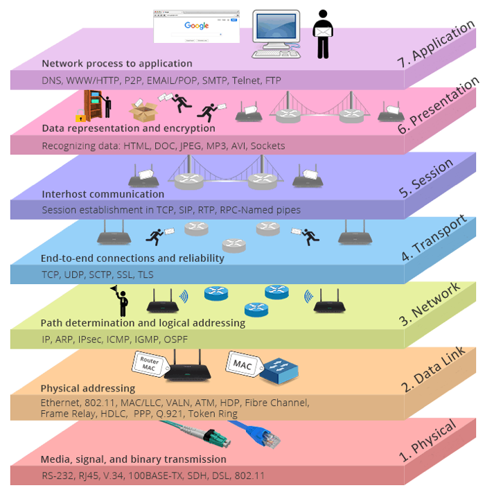
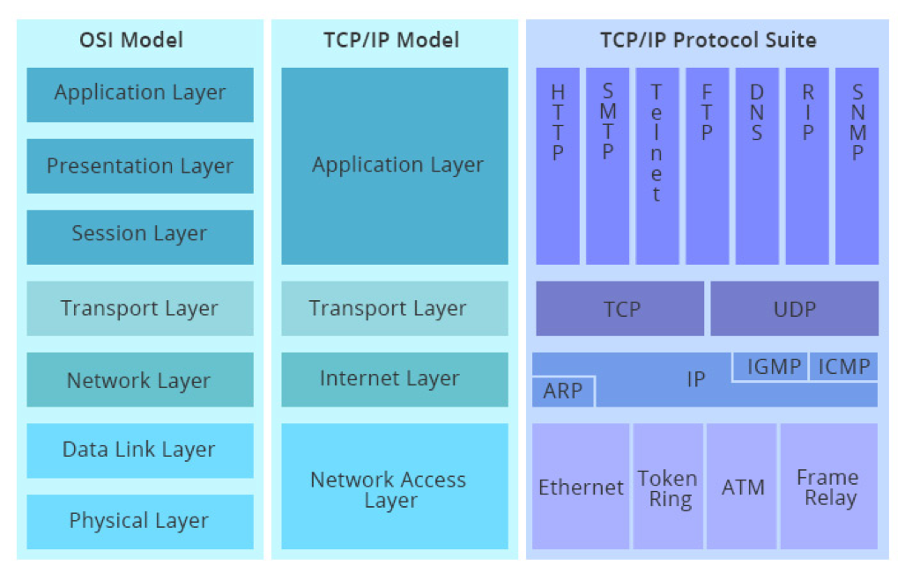
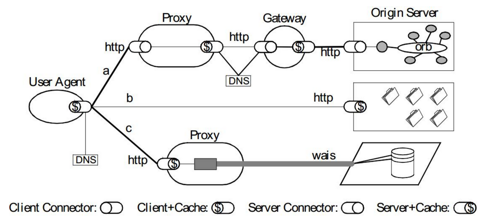

# 《Web 协议详解与抓包实战》学习笔记 Day 2

### OSI 概念模型

### OSI 模型与 TCP/IP 模型对照

### Wireshark 抓包及分析工具

### HTTP 协议

Roy Thomas Fielding：HTTP 主要作者，REST 架构作者

URI：统一资源标识符

### HTTP 解决了什么问题？

解决 WWW 信息交互必须面对的需求：

* 低门槛
* 可扩展性：巨大的用户群体，超长的寿命
* 分布式系统下的 Hypermedia：大粒度数据的网络传输
* Internet 规模
* 无法控制的 scalability
* 不可预测的负载、非法格式的数据、恶意消息
* 客户端不能保持所有服务器信息，服务器不能保持多个请求间的状态信息
* 独立的组件部署：新老组件并存
* 向前兼容：自 1993 年起 HTTP0.9\1.0（1996）已经被广泛使用

### 评估 Web 架构的关键属性

HTTP 协议应当在以下属性中取得可接受的均衡：
* 性能 Performance：影响高可用的关键因素
* 可伸缩性 Scalability：支持部署可以互相交互的大量组件
* 简单性 Simplicity：易理解、易实现、易验证
* 可见性 Visiable：对两个组件间的交互进行监视或者仲裁的能力。如缓存、分层设计等
* 可移植性 Portability：在不同的环境下运行的能力
* 可靠性 Reliability：出现部分故障时，对整体影响的程度
* 可修改性 Modifiability：对系统作出修改的难易程度，由可进化性、可定制性、可扩展性、可配置性、可重用性构成

### 架构属性：性能
* 网络性能 Network Performance
* Throughput 吞吐量：小于等于带宽 bandwidth
* Overhead 开销：首次开销，每次开销 • 用户感知到的性能 User-perceived Performance
* Latency 延迟：发起请求到接收到响应的时间
* Completion 完成时间：完成一个应用动作所花费的时间
* 网络效率 Network Efficiency • 重用缓存、减少交互次数、数据传输距离更近、COD

### 架构属性：可修改性
* 可进化性 Evolvability：一个组件独立升级而不影响其他组件
* 可扩展性 Extensibility ：向系统添加功能，而不会影响到系统的其他部分
* 可定制性 Customizability ：临时性、定制性地更改某一要素来提供服务， 不对常规客户产生影响
* 可配置性 Configurability ：应用部署后可通过修改配置提供新的功能
* 可重用性 Reusabilit ：组件可以不做修改在其他应用在使用

### REST 架构下的 Web

