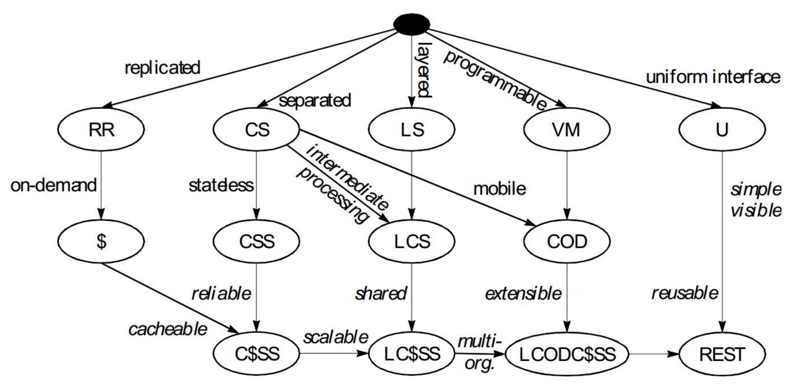

# 《Web 协议详解与抓包实战》学习笔记 Day 3

## 5 种架构风格

* `数据流风格` Data-flow Styles
  - 优点：简单性、可进化性、可扩展性、可配置性、可重用性
* `复制风格` Replication Styles
  - 优点：用户可察觉的性能、可伸缩性，网络效率、可靠性也可以提到提升
* `分层风格` Hierarchical Styles
  - 优点：简单性、可进化性、可伸缩性
* `移动代码风格` Mobile Code Styles
  - 优点：可移植性、可扩展性、网络效率
* `点对点风格` Peer-to-Peer Styles
  - 优点：可进化性、可重用性、可扩展性、可配置性

### 数据流风格 Data-flow Styles

* 管道与过滤器 Pipe And Filter，PF
  - 每个 Filter 都有输入端和输出端，只能从输入端读取数据，处理后再从输出端产生数据
* 统一接口的管道与过滤器 Uniform Pipe And Filter，UPF
  - 在 PF 上增加了统一接口的约束，所有 Filter 过滤器必须具备同样的接口

### 复制风格 Replication Styles

* 复制仓库 Replicated Repository, RR
  - 多个进程提供相同的服务，通过反向代理对外提供集中服务
* 缓存 $
  - RR的变体，通过复制请求的结果，为后续请求复用

### 分层风格Hierarchical Styles

* 客户端服务器 Client-Server，CS
  - 由 Client 触发请求，Server 监听到请求后产生响应，Client 一直等待收到响应后，会话结束
  - 分离关注点隐藏细节，良好的简单性、可伸缩性、可进化性
* 分层系统 Layered System，LS
  - 每一层为其之上的层服务，并使用在其之下的层所提供的服务，例如 TCP/IP
* 分层客户端服务器 Layered Client-Server，LCS
  - LS+CS，例如正向代理和反向代理，从空间上分为外部层与内部层
* 无状态、客户端服务器 Client-Stateless-Server，CSS
  - 基于 CS，服务器上不允许有session state会话状态
  - 提升了可见性、可伸缩性、可靠性，但重复数据导致降低网络性能
* 缓存、无状态、客户端服务器 Client-Cache-Stateless-Server，C$SS
  - 提升性能
* 分层、缓存、无状态、客户端服务器 Layered-Client-Cache-Stateless-Server，LC$SS
* 远程会话 Remote Session, RS
  - CS 变体，服务器保存 Application state 应用状态
  - 可伸缩性、可见性差
* 远程数据访问 Remote Data Access，RDA
  - CS 变体， Application state 应用状态同时分布在客户端与服务器
  - 巨大的数据集有可能通过迭代而减少
  - 简单性、可伸缩性差

### 移动代码风格 Mobile Code Styles

代码与执行过程或者执行结果分离，例如 Javascript

* 虚拟机 Virtual Machine，VM
  - 分离指令与实现
* 远程求值 Remote Evaluation，REV
  - 基于 CS 的 VM，将代码发送至服务器执行
* 按需代码 Code on Demand，COD
  - 服务器在响应中发回处理代码，在客户端执行
  - 优秀的可扩展性和可配置性，提升用户可察觉性能和网络效率
* 分层、按需代码、缓存、无状态、客户端服务器 Layered-Code-on-Demand-Client-Cache-Stateless-Server，LCODC$SS
  - LC$SS+COD
* 移动代理 Mobile Agent，MA
  - 相当于 REV+COD

### 点对点风格 Peer-to-Peer Styles

* Event-based Integration，EBI：
  - 基于事件集成系统，如由类似 Kafka 这样的消息系统 + 分发订阅来消除耦合
  - 优秀的可重用性、可扩展性、可进化性
  - 缺乏可理解性
  - 由于消息广播等因素造成的消息风暴，可伸缩性差
* Chiron-2，C2
  - 参见论文《A Component- and Message-Based Architectural Style for GUI Software》
  - 相当于 EBI+LCS，控制了消息的方向
* Distributed Objects，DO
  - 组件结对交互
* Brokered Distributed Objects，BDO
  - 引入名字解析组件来简化 DO，例如 CORBA

## 风格演化

> [课程链接《Web 协议详解与抓包实战》极客时间](http://gk.link/a/11UWp)
