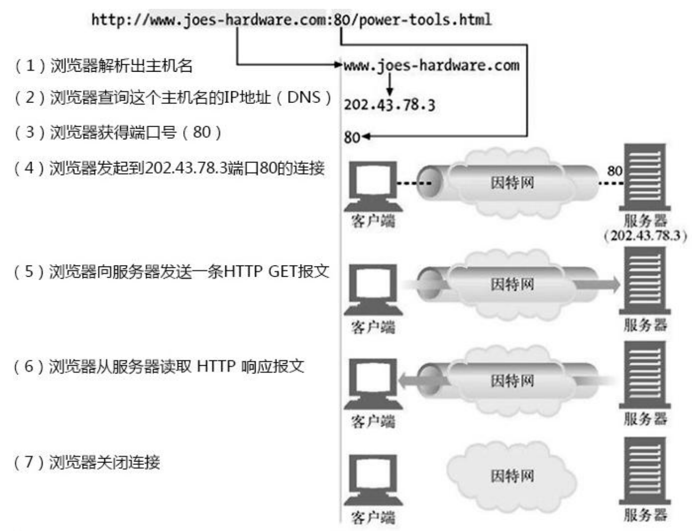
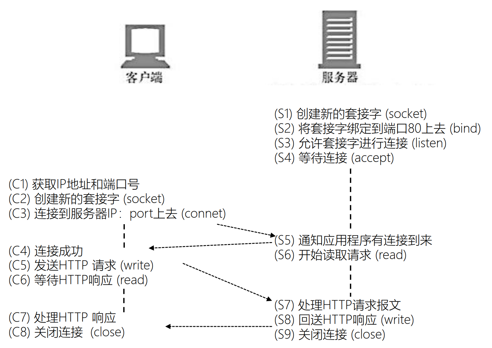
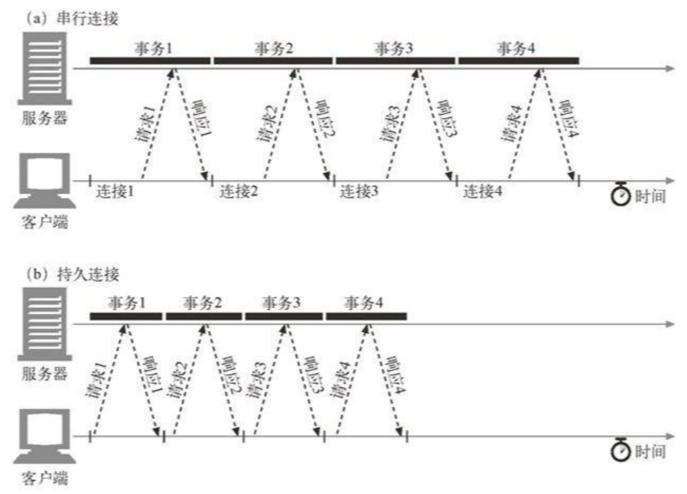
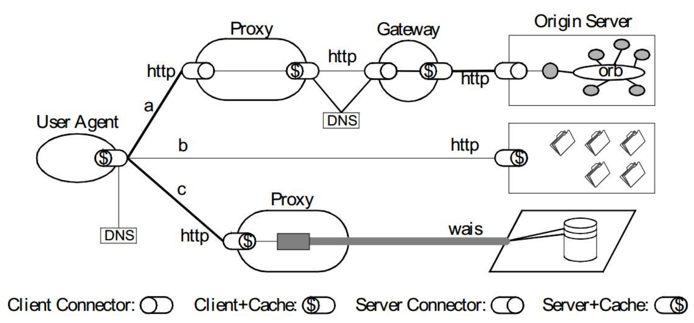

# # 《Web 协议详解与抓包实战》学习笔记 Day 6

## HTTP 连接的常见流程

## 从 TCP 编程上看 HTTP 请求处理

## 短连接与长连接

* Connection 头部
  - Keep-Alive：长连接
    - 客户端请求长连接
      - Connection: Keep-Alive
    - 服务器表示支持长连接
      - Connection: Keep-Alive
    - 客户端复用连接
    - HTTP/1.1 默认支持长连接
      - Connection: Keep-Alive 无意义
  - Close：短连接
  - 对代理服务器的要求
    - 不转发 Connection 列出头部，该头部仅与当前连接相关

## Connection 仅针对当前连接有效

user agent 与 origin server 间有层层 proxy 代理

## 代理服务器对长连接的支持

* 问题：各方间错误使用了长连接
  - 客户端发起长连接
  - 代理服务器陈旧，不能正确的处理请求的 Connection 头部，将客户端请求中的 Connection: Keep-Alive 原样转发给上游服务器
  - 上游服务器正确的处理了 Connection 头部，在发送响应后没有关闭连接，而试图保持、复用与不认长连接的代理服务器的连接
  - 代理服务器收到响应中 Connection: Keep-Alive 后不认，转发给客户端，同时等待服务器关闭短连接
  - 客户端收到了 Connection: Keep-Alive，认为可以复用长连接，继续在该连接上发起请求
  - 代理服务器出错，因为短连接上不能发起两次请求
* Proxy-Connection
  - 陈旧的代理服务器不识别该头部：退化为短连接
  - 新版本的代理服务器理解该头部
    - 与客户端建立长连接
    - 与服务器使用 Connection 替代 Proxy-Connect 头部

## Host 头部
* Host = uri-host [ ":" port ]
  - HTTP/1.1 规范要求，不传递 Host 头部则返回 400 错误响应码
  - 为防止陈旧的代理服务器，发向正向代理的请求 request-target 必须以absolute-form 形式出现
    - request-line = method SP request-target SP HTTP-version CRLF
    - absolute-form = absolute-URI
      - absolute-URI = scheme ":" hier-part [ "?" query ]

## 规范与实现间是有差距的

* 关于 Host 头部：https://tools.ietf.org/html/rfc7230#section-5.4
  - A client MUST send a Host header field in all HTTP/1.1 request messages.
  -  A server MUST respond with a 400 (Bad Request) status code to any HTTP/1.1 request message that lacks a Host header field and to any request message that contains more than one Host header field or a Host header field with an invalid field-value.

## Host 头部与消息的路由

1. 建立 TCP 连接，确定服务器的 IP 地址
2. 接收请求
3. 寻找虚拟主机，匹配 Host 头部与域名
4. 寻找 URI 的处理代码，匹配 URI
5. 执行处理请求的代码，访问资源
6. 生成 HTTP 响应，各中间件基于 PF 架构串行修改响应
7. 发送 HTTP 响应
8. 记录访问日志

## 客户端与源服务器间存在多个代理

## 消息的转发
* Max-Forwards 头部
  - 限制 Proxy 代理服务器的最大转发次数，仅对 TRACE/OPTIONS 方法有效
  - Max-Forwards = 1*DIGIT
* Via 头部
  - 指明经过的代理服务器名称及版本
  - Via = 1#( received-protocol RWS received-by [ RWS comment ] )
    - received-protocol = [ protocol-name "/" ] protocol-version
    - received-by = ( uri-host [ ":" port ] ) / pseudonym
    - pseudonym = token
* Cache-Control:no-transform
  - 禁止代理服务器修改响应包体

> [课程链接《Web 协议详解与抓包实战》极客时间](http://gk.link/a/11UWp)
