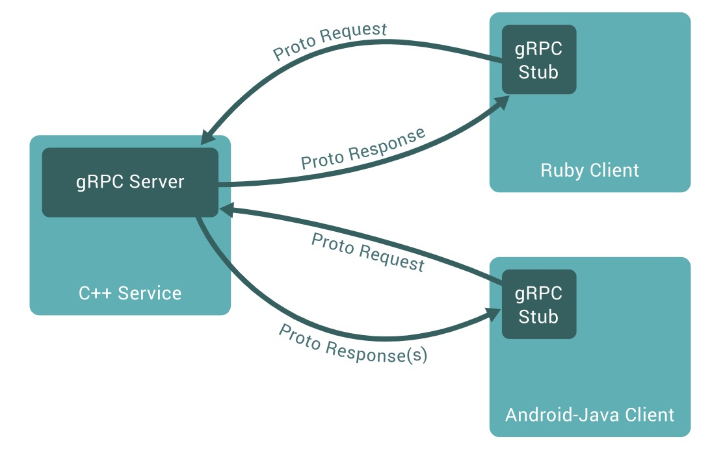

# HTTP/2 与 gRPC 框架

### gRPC：支持多语言编程、基于 HTTP/2 通讯的中间件

### gRPC 测试

* 官网：https://grpc.io/
* 基于 Python 语言搭建测试环境
* https://grpc.io/docs/quickstart/python/
* 测试程序
* git clone -b v1.21.0 https://github.com/grpc/grpc
* cd grpc/examples/python/helloworld
* 服务器：python greeter_server.py
* 客户端：python greeter_client.py
* 注意• 欲抓取环回报文，请安装时勾选【install Npcap in Winpcap API-Compatible Mode 】
* 如果 Npcap Loopback Adapter 未抓取到环回报文，请尝试其他接口
* 若 50051 端口未被识别为 http/2，请手动设置“解码为 HTTP/2”

### Protocol Buffers 编码：消息结构

### Protocol Buffers 编码：数据类型 Wire Type

### Protocol Buffers 字符串编码举例

> 此文章为 3 月 Day4 学习笔记，内容来源于极客时间[《Web 协议详解与抓包实战》](http://gk.link/a/11UWp)，强烈推荐该课程！
