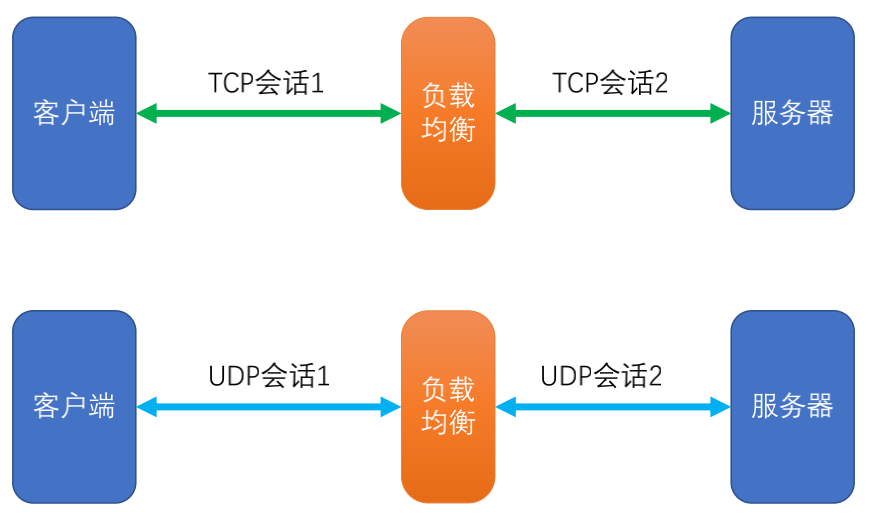
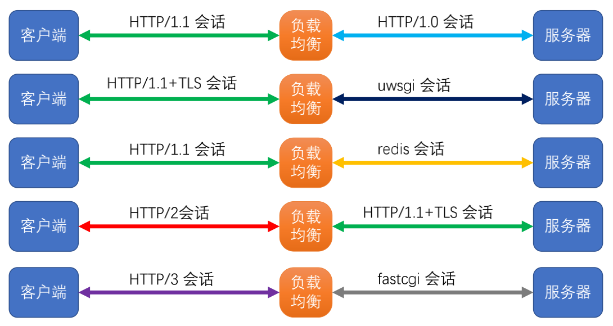
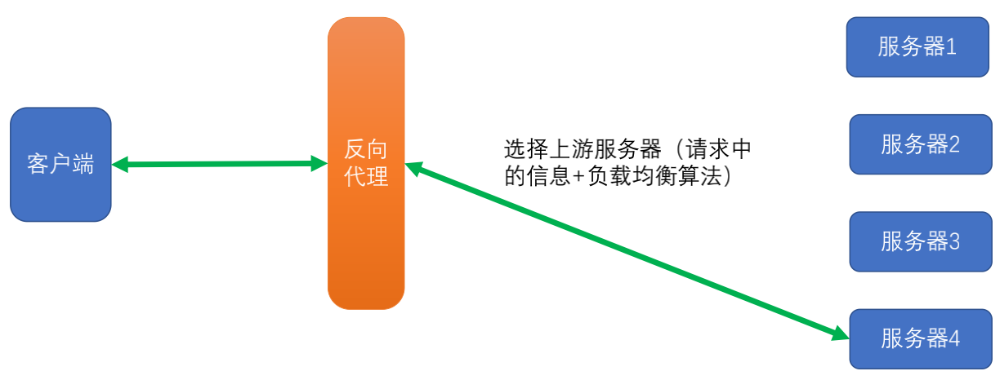
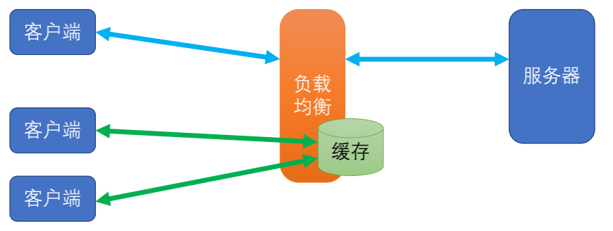

# 七层负载均衡做了些什么

### 四层负载均衡

### 七层负载均衡协议转换举例

### HTTP 协议转换

* request line 起始行
  - URL 重写（包括 query 参数转换）
  - method 变换
  - http version 版本变换
* header 头部
  - header 名字、值作转换（如 HTTP/2 索引表中查询头部，转换为适配协议格式）
  - 负载均衡对 header 作修改
    - 隐藏某个 header（例如隐藏 X-Accel-Expires 等头部）
    - 新增 header（例如 CORS 允许跨域访问）
    - 修改 header 的 value 值（例如修改 Server 头部的值）
* body 包体
  - 对内容使用通用算法（如压缩算法）转换
  - 按固定协议格式对内容进行转换

### WAF 防火墙（Web Application Firewall）

* request line 请求行
  - 检查 URL 及 query 参数是否合法（如 SQL 注入）
  - method 方法是否合法（例如阻止 TRACE 方法）
  - http version 版本是否合法（例如不接收 HTTP/1.0 请求）
* header 头部
  - 检查 header 项是否符合应用场景要求
* body 包体
  - 对于FORM表单等通用格式做过滤

### 负载均衡算法

### 缓存功能

> 此文章为 3 月 Day6 学习笔记，内容来源于极客时间[《Web 协议详解与抓包实战》](http://gk.link/a/11UWp)，强烈推荐该课程！
