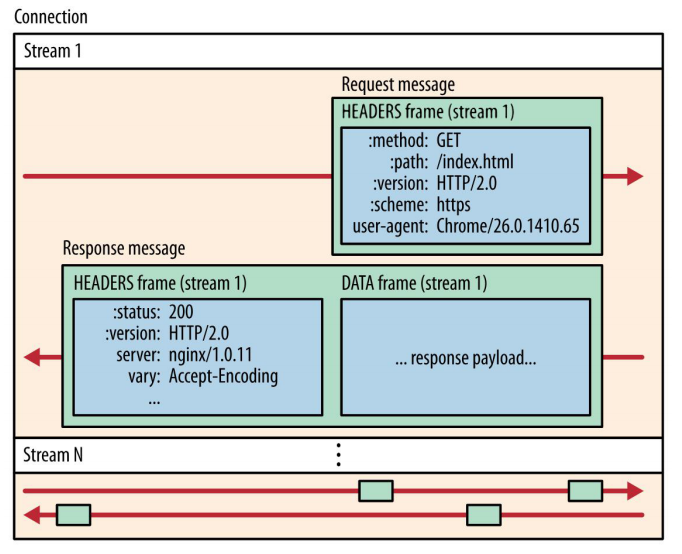
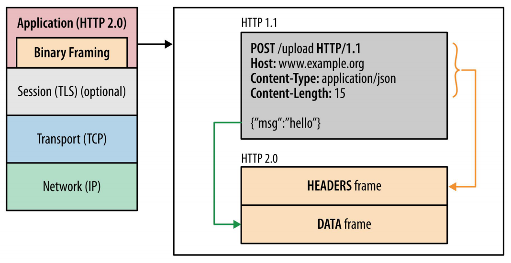
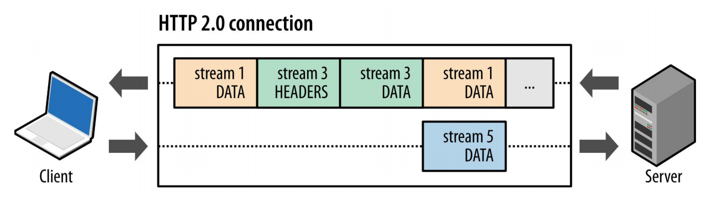
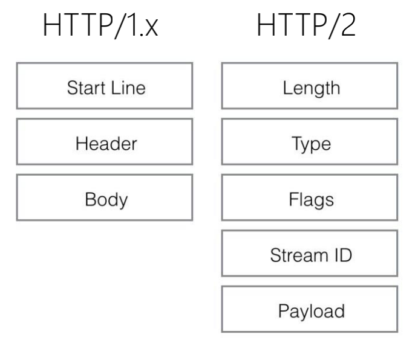

# 流、消息、帧的关系

### HTTP/2 核心概念

* 连接 Connection：1 个 TCP 连接，包含一个 或者多个 Stream
* 数据流 Stream：一个双向通讯数据流，包含 1 条或者多条 Message
* 消息 Message：对应 HTTP/1 中的请求或者响应，包含一条或者多条 Frame
* 数据帧 Frame：最小单位，以二进制压缩格式存放 HTTP/1 中的内容

### Stream、Message、Frame 间的关系

### 消息的组成：HEADERS 帧与 DATA 帧

### 传输中无序，接收时组装

### 消息与帧

> 此文章为 2 月 Day10 学习笔记，内容来源于极客时间[《Web 协议详解与抓包实战》](http://gk.link/a/11UWp)，强烈推荐该课程！

---

另外，最近重温操作系统时发现了一个免费精品好课，闪客的《Linux0.11源码趣读》，这个课给我感觉像在用看小说的心态学操作系统源码，写的确实挺牛的，通俗易懂，直指本源，我自己也跟着收获了很多。这个课在极客时间上是免费的，口碑很不错，看评论下很多人在催更和重温，强烈推荐！[戳此链接领取](https://time.geekbang.org/opencourse/intro/100310101?utm_source=linux_dk&utm_term=linux_dk)
