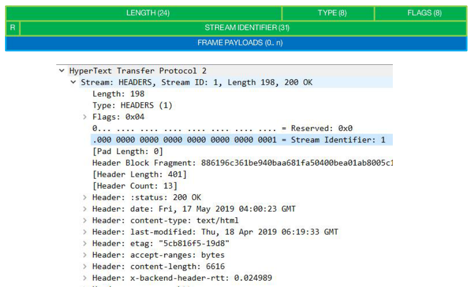

# 帧格式：Stream 流 ID 的作用

### 对比 Websocket 的帧格式

### 9 字节标准帧头部

### 标准帧头示意

### Stream ID 的作用

* 实现多路复用的关键
  - 接收端的实现可据此并发组装消息
  - 同一 Stream 内的 frame 必须是有序的（无法并发）
  - SETTINGS_MAX_CONCURRENT_STREAMS 控制着并发 Stream 数

* 推送依赖性请求的关键
  - 由客户端建立的流必须是奇数
  - 由服务器建立的流必须是偶数

* 流状态管理的约束性规定
  - 新建立的流 ID 必须大于曾经建立过的状态为 opened 或者 reserved 的流 ID
  - 在新建立的流上发送帧时，意味着将更小 ID 且为 idle 状态的流置为 closed 状态
  - Stream ID 不能复用，长连接耗尽 ID 应创建新连接

* 应用层流控仅影响数据帧
  - Stream ID 为 0 的流仅用于传输控制帧
* 在HTTP/1 升级到 h2c 中，以 ID 为 1 流返回响应，之后流进入half-closed (local)状态

> 此文章为 2 月 Day11 学习笔记，内容来源于极客时间[《Web 协议详解与抓包实战》](http://gk.link/a/11UWp)，强烈推荐该课程！

---

另外，最近重温操作系统时发现了一个免费精品好课，闪客的《Linux0.11源码趣读》，这个课给我感觉像在用看小说的心态学操作系统源码，写的确实挺牛的，通俗易懂，直指本源，我自己也跟着收获了很多。这个课在极客时间上是免费的，口碑很不错，看评论下很多人在催更和重温，强烈推荐！[戳此链接领取](https://time.geekbang.org/opencourse/intro/100310101?utm_source=linux_dk&utm_term=linux_dk)
