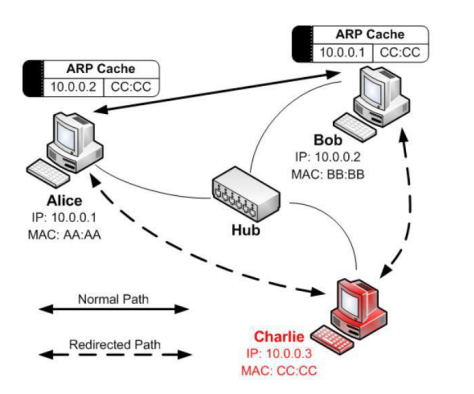

# IP 地址与链路地址的转换

### 链路层 MAC 地址

* 链路层地址 MAC（Media Access Control Address）
  - 实现本地网络设备间的直接传输
* 网络层地址 IP（Internet Protocol address）
  - 实现大型网络间的传输
* 查看 MAC 地址
  - Windows: ipconfig /all
  - Linux：ifconfig

### 从 IP 地址寻找 MAC 地址

* 动态地址解析协议 ARP（RFC826）
  - Address Resolution Protocol
* 动态地址解析：广播

### 2.5 层协议：ARP

* 检查本地缓存
  - Windows: arp –a
  - Linux: arp –nv
  - Mac: arp -nla
* 广播形式的请求
* 单播形式的应答

### ARP 报文格式：FrameType=0x0806

* 硬件类型，如 1 表示以太网
* 协议类型，如 0x0800 表示 IPv4
* 硬件地址长度，如 6
* 协议地址长度，如 4 表示 IPv4
* 操作码，如 1 表示请求，2 表示应答
* 发送方硬件地址
* 发送方协议地址
* 目标硬件地址
* 目标协议地址

### 2.5 层协议 RARP：从 MAC 地址中寻找 IP 地址

* 动态地址解析协议 RARP（RFC903）
  - Reverse Address Resolution Protocol

### RARP 的工作流程

* 广播形式的请求
* 单播形式的应答

### RARP 报文格式：FrameType=0x8035

* 硬件类型，如 1 表示以太网
* 协议类型，如 0x0800 表示 IPv4
* 硬件地址长度，如 6
* 协议地址长度，如 4 表示 IPv4
* 操作码，如 3 表示请求，4 表示应答
* 发送方硬件地址
* 发送方协议地址
* 目标硬件地址
* 目标协议地址

### ARP 欺骗（ARP spoofing/poisoning）

> 此文章为 4 月 Day8 学习笔记，内容来源于极客时间[《Web 协议详解与抓包实战》](http://gk.link/a/11UWp)，强烈推荐该课程！
