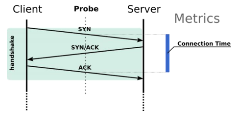
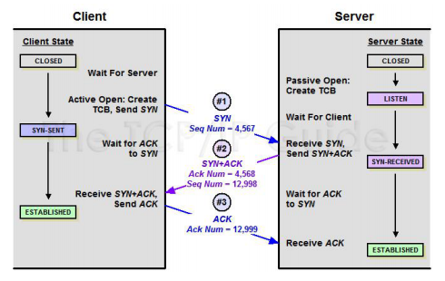
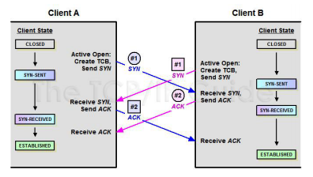

# 三次握手建立连接

### 握手的目标

* 同步 Sequence 序列号
* 初始序列号 ISN（Initial Sequence Number）
* 交换 TCP 通讯参数
* 如 MSS、窗口比例因子、选择性确认、指定校验和算法

### 三次握手

* SYN：同步
* ACK：确认

### 三次握手流程

* CLOSED
* LISTEN
* SYN-SENT
* SYN-RECEIVED
* ESTABLISHED

### netstat 命令查看 TCP 状态

* interval: 重新显示选定的统计信息，各个显示间暂停的间隔秒数。
* -a: 显示所有连接和侦听端口。
* -n: 以数字形式（如 IP 地址）显示地址和端口号。
* -r: 显示路由表。
* -s: 显示每个协议的统计信息。
* -o(Windows): 显示拥有的与每个连接关联的进程 ID。
* -b(Windows)/-p(Linux) : 显示对应的可执行程序名字。

### 两端同时发送SYN：双方使用固定源端口且同时建连接

* TCB： Transmission Control Block，保存连接使用的源端口、目的端口、目的 ip、序号、 应答序号、对方窗口大小、己方窗口大小、tcp 状态、tcp 输入/输出队列、应用层输出队 列、tcp 的重传有关变量等

> 此文章为 3 月 Day20 学习笔记，内容来源于极客时间[《Web 协议详解与抓包实战》](http://gk.link/a/11UWp)，强烈推荐该课程！
