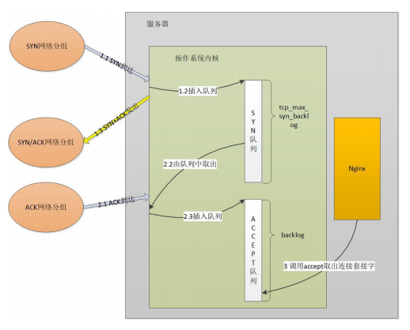
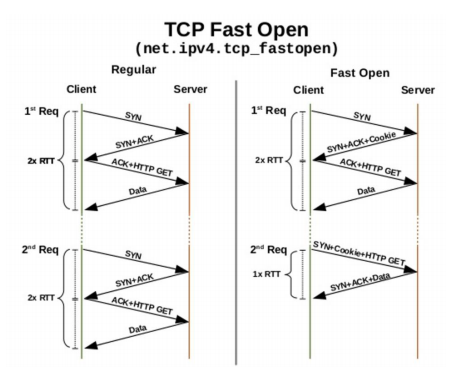
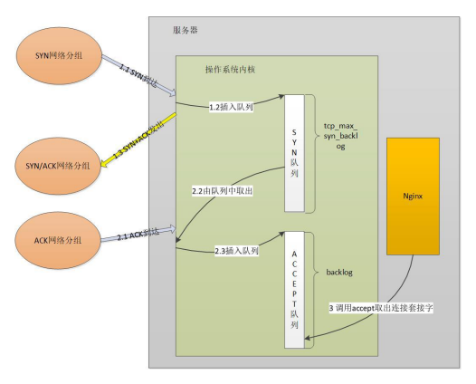

# 三次握手中的性能优化与安全问题

### 服务器三次握手流程示例

### 超时时间与缓冲队列

* 应用层 connect 超时时间调整
* 操作系统内核限制调整
  - 服务器端 SYN_RCV 状态
    - net.ipv4.tcp_max_syn_backlog：SYN_RCVD 状态连接的最大个数
    - net.ipv4.tcp_synack_retries：被动建立连接时，发SYN/ACK的重试次数
  - 客户端 SYN_SENT 状态
    - net.ipv4.tcp_syn_retries = 6 主动建立连接时，发 SYN 的重试次数
    - net.ipv4.ip_local_port_range = 32768 60999 建立连接时的本地端口可用范围
  - ACCEPT队列设置

### Fast Open 降低时延

### Linux上打开TCP Fast Open

* net.ipv4.tcp_fastopen：系统开启 TFO 功能
  - 0：关闭
  - 1：作为客户端时可以使用 TFO
  - 2：作为服务器时可以使用 TFO
  - 3：无论作为客户端还是服务器，都可以使用 TFO

### 如何应对 SYN 攻击？

攻击者短时间伪造不同 IP 地址的 SYN 报文，快速占满 backlog 队列，使 服务器不能为正常用户服务

* net.core.netdev_max_backlog
  - 接收自网卡、但未被内核协议栈处理的报文队列长度
* net.ipv4.tcp_max_syn_backlog
  - SYN_RCVD 状态连接的最大个数
* net.ipv4.tcp_abort_on_overflow
  - 超出处理能力时，对新来的 SYN 直接回包 RST，丢弃连接

### tcp_syncookies

* net.ipv4.tcp_syncookies = 1
  - 当 SYN 队列满后，新的 SYN 不进入队列，计算出 cookie 再 以 SYN+ACK 中的序列号返回客户端，正常客户端发报文时， 服务器根据报文中携带的 cookie 重新恢复连接
  - 由于 cookie 占用序列号空间，导致此时所有 TCP 可选 功能失效，例如扩充窗口、时间戳等

### TCP_DEFER_ACCEPT

> 此文章为 3 月 Day21 学习笔记，内容来源于极客时间[《Web 协议详解与抓包实战》](http://gk.link/a/11UWp)，强烈推荐该课程！
