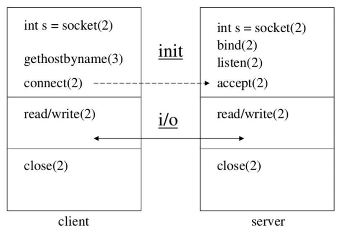
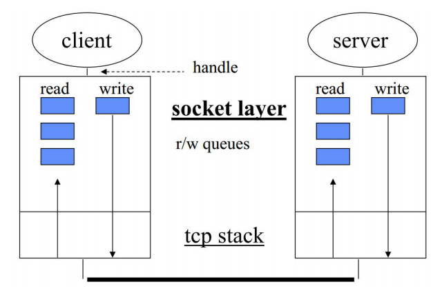

# 数据传输与 MSS 分段

### TCP 应用层编程示例

### TCP 流的操作

### TCP 流与报文段

* 流分段的依据
* MSS：防止 IP 层分段
* 流控：接收端的能力

### MSS：Max Segment Size

* 定义：仅指 TCP 承载数据，不包含 TCP 头部的大小，参见 RFC879
* MSS 选择目的
  - 尽量每个 Segment 报文段携带更多的数据，以减少头部空间占用比率
  - 防止 Segment 被某个设备的 IP 层基于 MTU 拆分
* 默认 MSS：536 字节（默认 MTU576 字节，20 字节 IP 头部，20 字节 TCP 头部）
* 握手阶段协商 MSS
* MSS 分类
  - 发送方最大报文段 SMSS：SENDER MAXIMUM SEGMENT SIZE
  - 接收方最大报文段 RMSS：RECEIVER MAXIMUM SEGMENT SIZE

### TCP 握手常用选项

| 类型 | 总长度 （字节） | 数据             | 描述                       |
|----|----------|----------------|--------------------------|
| 0  | -        | -              | 选项列表末尾标识                 |
| 1  | -        | -              | 无意义，用于 32 位对齐使用          |
| 2  | 4        | MSS 值          | 握手时发送端告知可以接收的最大报文段大小     |
| 3  | 3        | 窗口移位           | 指明最大窗口扩展后的大小             |
| 4  | 2        | -              | 表明支持 SACK 选择性确认中间报文段功能   |
| 5  | 可变       | 确认报文段          | 选择性确认窗口中间的 Segments 报文段  |
| 8  | 10       | Timestamps 时间戳 | 用于更精准的计算 RTT，及解决 PAWS 问题 |
| 14 | 3        | 校验和算法          | 双方认可后，可使用新的校验和算法         |
| 15 | 可变       | 校验和            | 当 16 位标准校验和放不下时，放置在这里    |
| 34 | 可变       | FOC            | TFO 中 Cookie             |

> 此文章为 3 月 Day22 学习笔记，内容来源于极客时间[《Web 协议详解与抓包实战》](http://gk.link/a/11UWp)，强烈推荐该课程！
