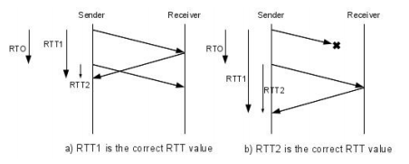
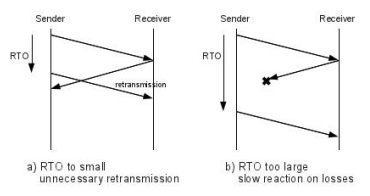

# RTO 重传定时器的计算

### 如何测量 RTT？如何在重传下有效测量 RTT？

* RTT 测量的第 2 种方法
* 发送时间
* 数据包中 Timestamp 选项的回显时间

### RTO（ Retransmission TimeOut ）应当设多大？

* RTO 应当略大于 RTT

### RTO 应当更平滑

* 平滑 RTO：RFC793，降低瞬时变化
  - SRTT （smoothed round-trip time） = ( α * SRTT ) + ((1 - α) *   -TT)
    - α 从 0到 1（RFC 推荐 0.9），越大越平滑
  - RTO = min[ UBOUND, max[ LBOUND, (β * SRTT) ] ]
    - 如 UBOUND为1分钟，LBOUND为 1 秒钟， β从 1.3 到 2 之间
  - 不适用于 RTT 波动大（方差大）的场景

## 追踪 RTT 方差

* RFC6298（RFC2988），其中α = 1/8， β = 1/4，K = 4，G 为最小时间颗粒：
  - 首次计算 RTO，R为第 1 次测量出的 RTT
    - SRTT（smoothed round-trip time） = R
    - RTTVAR（round-trip time variation） = R/2
    - RTO = SRTT + max (G, K*RTTVAR)
  - 后续计算 RTO，R’为最新测量出的 RTT
    - SRTT = (1 - α) * SRTT + α * R’
    - RTTVAR = (1 - β) * RTTVAR + β * |SRTT - R’|
    - RTO = SRTT + max (G, K*RTTVAR)

> 此文章为 3 月 Day24 学习笔记，内容来源于极客时间[《Web 协议详解与抓包实战》](http://gk.link/a/11UWp)，强烈推荐该课程！
