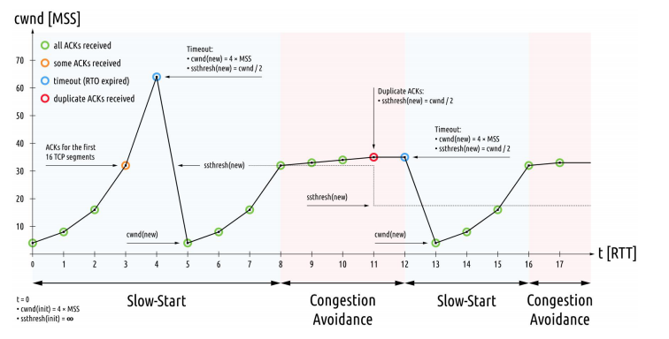

# 慢启动与拥塞控制

### 全局思考：拥塞控制

* 慢启动
* 拥塞避免
* 快速重传
* 快速恢复

### 拥塞控制历史

* 以丢包作为依据
  - New Reno：RFC6582
  - BIC：Linux2.6.8 – 2.6.18
  - CUBIC（RFC8312）：Linux2.6.19
* 以探测带宽作为依据
  - BBR：Linux4.9

### 慢启动

* 拥塞窗口cwnd（congestion window）
  - 通告窗口rwnd（receiver‘s advertised window）
  - 发送窗口swnd = min(cwnd，rwnd)
* 每收到一个ACK，cwnd扩充一倍

### 慢启动的初始窗口

* 慢启动初始窗口 IW(Initial Window)的变迁
  - 1 SMSS：RFC2001（1997）
  - 2 - 4 SMSS：RFC2414（1998）
    - IW = min (4*SMSS, max (2*SMSS, 4380 bytes))
  - 10 SMSS：RFC6928（2013）
    - IW = min (10*MSS, max (2*MSS, 14600))

### 拥塞避免

* 慢启动阈值 ssthresh(slow start threshold)：
  - 达到 ssthresh 后，以线性方式增加 cwnd
    - cwnd += SMSS*SMSS/cwnd

### 慢启动与拥塞控制

> 此文章为 3 月 Day28 学习笔记，内容来源于极客时间[《Web 协议详解与抓包实战》](http://gk.link/a/11UWp)，强烈推荐该课程！
