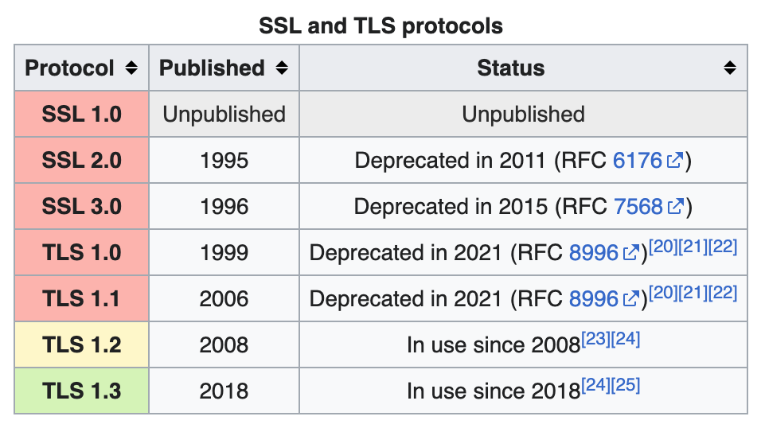

# TLS/SSL 协议的工作原理

### TLS 设计目的

* 身份验证
* 保密性
* 完整性

### TLS/SSL 发展

传输层安全性协议（英语：Transport Layer Security，缩写：TLS）前身称为安全套接层（英语：Secure Sockets Layer，缩写：SSL）是一种安全协议，目的是为互联网通信提供安全及数据完整性保障。

网景公司（Netscape）在1994年推出首版网页浏览器－网景导航者时，推出HTTPS协议，以SSL进行加密，这是SSL的起源。

IETF将SSL进行标准化，1999年公布TLS 1.0标准文件（RFC 2246）。随后又公布TLS 1.1（RFC 4346，2006年）、TLS 1.2（RFC 5246，2008年）和TLS 1.3（RFC 8446，2018年）。

### TLS 协议

* Record 记录协议
  - 对称加密
* Handshake 握手协议
  - 验证通讯双方的身份
  - 交换加解密的安全套件
  - 协商加密参数

### TLS 安全密码套件解读

* 密钥交换算法
* 身份验证算法
* 对称加密算法、强度、工作模式
* 签名hash算法

> 此文章为 3 月 Day7 学习笔记，内容来源于极客时间[《Web 协议详解与抓包实战》](http://gk.link/a/11UWp)，强烈推荐该课程！
