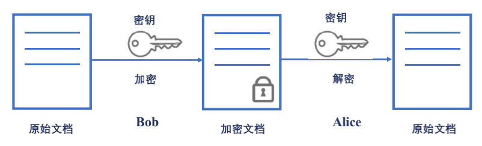
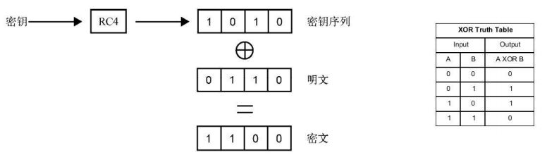
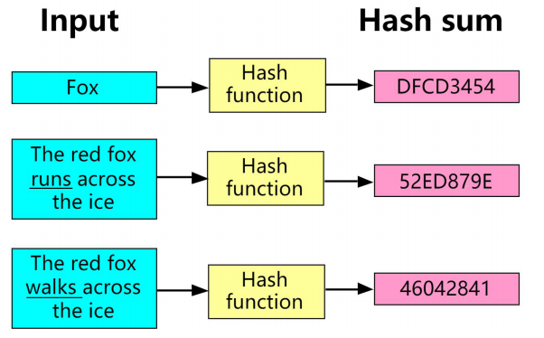
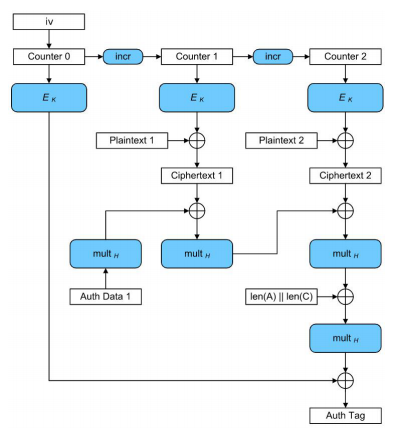

# 对称加密的工作原理

### 对称加密

### AES 对称加密在网络中的应用

### 对称加密与 XOR 异或运算

### 填充 padding

* Block cipher 分组加密：将明文分成多个等长的 Block 模块，对每个模块分别加解密
* 目的：当最后一个明文 Block 模块长度不足时，需要填充
* 填充方法
  - 位填充：以 bit 位为单位来填充
  - 字节填充：以字节为单位为填充

### 分组工作模式 block cipher mode of operation

允许使用同一个分组密码密钥对多于一块的数据进行加密，并保证其安全性

* ECB（Electronic codebook）模式
  - 直接将明文分解为多个块，对每个块独立 加密
  - 问题：无法隐藏数据特征
* CBC（Cipher-block chaining）模式
  - 每个明文块先与前一个密文块进行异或后，再进行加密
  - 问题：加密过程串行化

* CTR（Counter）模式
  - 通过递增一个加密计数器以产生连续的密钥流
  - 问题：不能提供密文消息完整性校验

* 验证完整性：hash 函数

* 验证完整性：MAC（Message Authentication Code）

* Galois/Counter Mode
  - CTR+GMAC

> 此文章为 3 月 Day8 学习笔记，内容来源于极客时间[《Web 协议详解与抓包实战》](http://gk.link/a/11UWp)，强烈推荐该课程！
