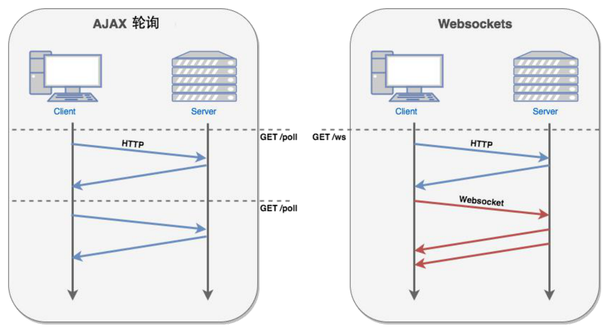

# WebSocket 解决什么问题

### 如何及时获得更新？从轮询到通知

### Chrome 请求列表：分析 WebSocket

* 过滤器
  - 按类型：WS
  - 属性过滤：is: running
* 表格列
  - Data： 消息负载。 如果消息为纯文本，则在此处显示。 对于二进制操作码，此列将显示操作码的名称和代码。 支持以下操作码：Continuation Frame、Binary Frame、Connection Close Frame、Ping Frame 和 Pong Frame
  - Length： 消息负载的长度（以字节为单位）
  - Time： 收到或发送消息的时间
* 消息颜色
  - 发送至服务器的文本消息为浅绿色
  - 接收到的文本消息为白色
  - WebSocket 操作码为浅黄色
  - 错误为浅红色

### 支持双向通讯的 WebSocket

* rfc6455（2011.12）
* 双向通讯的优劣？
* 如何管理会话？
* 如何维持长连接？
* 兼容 HTTP 协议
  - 端口复用
* 支持扩展
  - 如 permessage-deflate 扩展

> 此文章为 2 月 Day1 学习笔记，内容来源于极客时间[《Web 协议详解与抓包实战》](http://gk.link/a/11UWp)，强烈推荐该课程！
