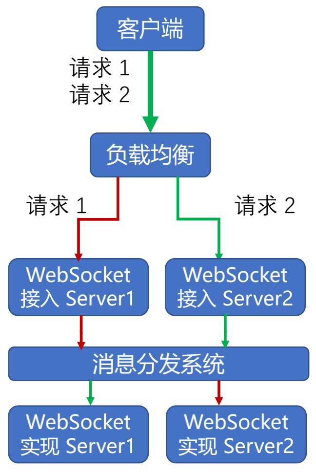

# WebSocket 的约束

### WebSocket 的成本

* 实时性与可伸缩性
  - 牺牲了简单性
* 网络效率与无状态：请求 2 基于请求 1
  - 牺牲了简单性与可见性

### 长连接的心跳保持

* HTTP 长连接只能基于简单的超时（常见为 65 秒）
* WebSocket 连接基于 ping/pong 心跳机制维持

### 兼容 HTTP 协议

* 默认使用 80 或者 443 端口
* 协议升级
* 代理服务器可以简单支持

### 设计哲学：在 Web 约束下暴露 TCP 给上层
* 元数据去哪了？
  - 对比：HTTP 协议头部会存放元数据
  - 由 WebSocket 上传输的应用层存放元数据
* 基于帧：不是基于流（HTTP、TCP）
  - 每一帧要么承载字符数据，要么承载二进制数据
* 基于浏览器的同源策略模型（非浏览器无效）
  - 可以使用 Access-Control-Allow-Origin 等头部
* 基于 URI、子协议支持同主机同端口上的多个服务

> 此文章为 2 月 Day2 学习笔记，内容来源于极客时间[《Web 协议详解与抓包实战》](http://gk.link/a/11UWp)，强烈推荐该课程！
