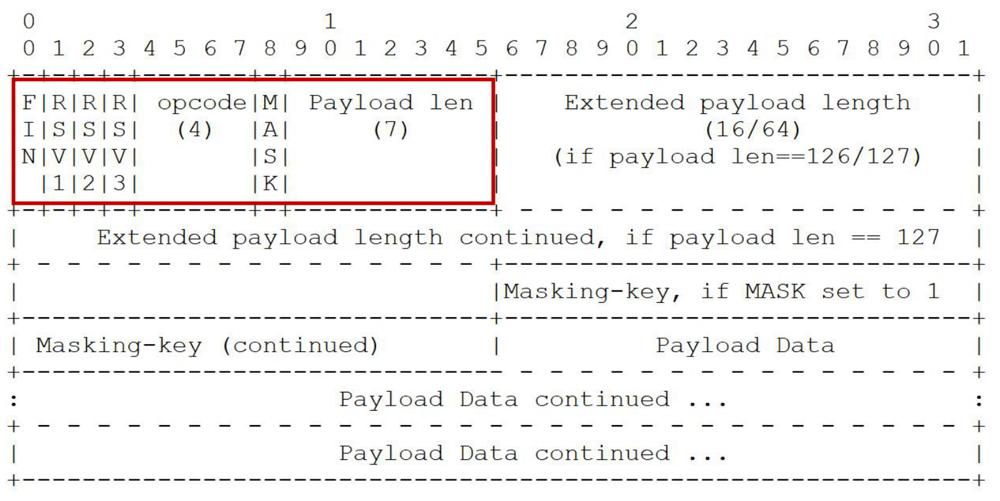
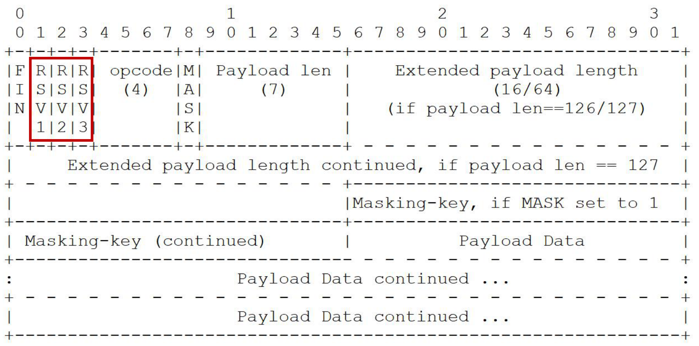
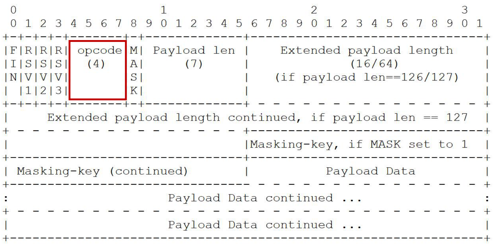

# WebSocket 协议格式

### 帧格式示意图



红色是 2 字节必然存在的帧首部

### 数据帧格式：RSV 保留值



RSV1/RSV2/RSV3：默认为 0，仅当使用 extension 扩展时，由扩展决定其值

### 数据帧格式：帧类型



* 持续帧
  - 0：继续前一帧
* 非控制帧
  - 1：文本帧（UTF8）
  - 2：二进制帧
  - 3-7：为非控制帧保留
* 控制帧
  - 8：关闭帧
  - 9：心跳帧 ping
  - A：心跳帧 pong
  - B-F：为控制帧保留

### ABNF 描述的帧格式

```
ws-frame = frame-fin ; 1 bit in length
           frame-rsv1 ; 1 bit in length
           frame-rsv2 ; 1 bit in length
           frame-rsv3 ; 1 bit in length
           frame-opcode ; 4 bits in length
           frame-masked ; 1 bit in length
           frame-payload-length ; 3 种长度
           [ frame-masking-key ] ; 32 bits in length
           frame-payload-data ; n*8 bits in ; length, where ; n >= 0
```

> 此文章为 2 月 Day3 学习笔记，内容来源于极客时间[《Web 协议详解与抓包实战》](http://gk.link/a/11UWp)，强烈推荐该课程！
