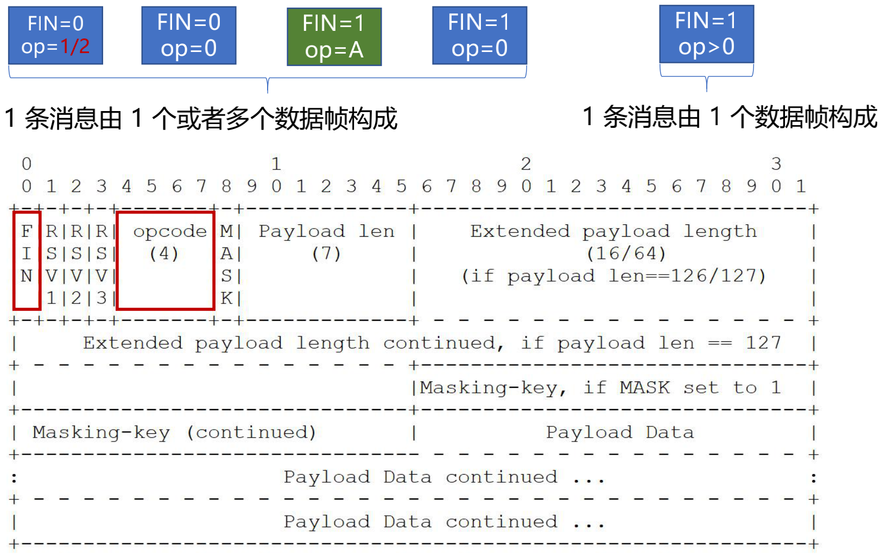
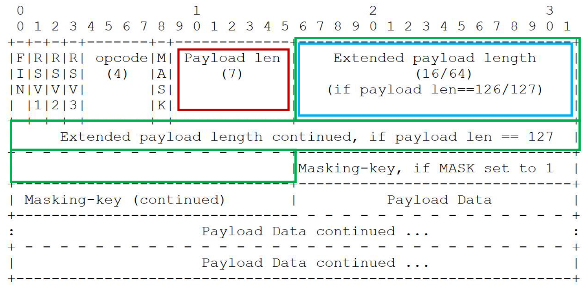
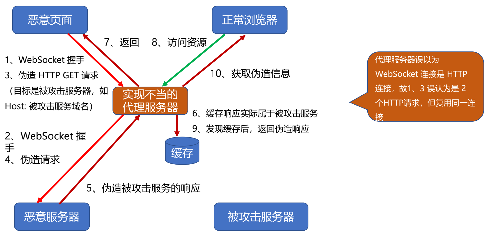
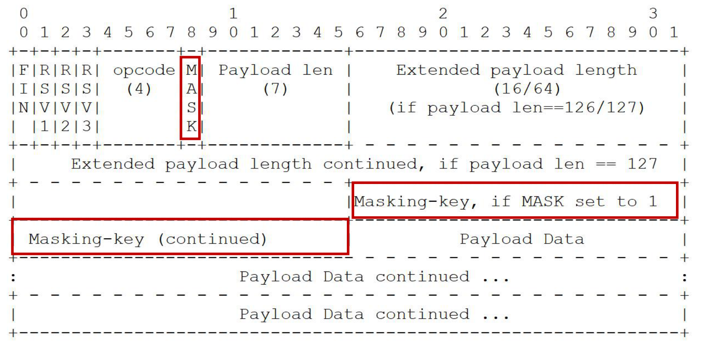

# WebSocket 传递消息时的编码格式

## 传递消息时的编码格式

### 消息与数据帧

* Message 消息
  - 1 条消息由 1 个或者多个帧组成，这些数据帧属于同一类型
  - 代理服务器可能合并、拆分消息的数据帧
* Frame 数据帧
  - 持续帧
  - 文本帧、二进制帧

### 非控制帧的消息分片：有序

### 数据帧格式：消息内容的长度

* 消息内容长度组成
  - 应用消息长度
  - 扩展数据长度
* <=125 字节
  - 仅使用 Payload len
* 126 至 2^16-1
  - Payload len 值为 126
  - Extended payload length16 位表示长度
* 2^16 至 2^64-1
  - Payload len 值为 127
  - Extended payload length 共 8 字节 64 位表示长度

### 发送消息

* 确保 WebSocket 会话处于 OPEN 状态
* 以帧来承载消息，一条消息可以拆分多个数据帧
* 客户端发送的帧必须基于掩码编码
* 一旦发送或者接收到关闭帧，连接处于 CLOSING 状态
* 一旦发送了关闭帧，且接收到关闭帧，连接处于 CLOSED 状态
* TCP 连接关闭后，WebSocket 连接才完全被关闭

## 掩码及其所针对的代理污染攻击

### 针对代理服务器的缓存污染攻击

### frame-masking-key 掩码

* 客户端消息：MASK 为 1（包括控制帧），传递 32 位无法预测的、随机的 Masking-key
* 服务器端消息：MASK 为 0

### 掩码如何防止缓存污染攻击？

* 目的：防止恶意页面上的代码，可以经由浏览器构造出合法的 GET 请求，使得代理服务 器可以识别出请求并缓存响应
* 强制浏览器执行以下方法：
  - 生成随机的 32 位 frame-masking-key，不能让 JS 代码猜出（否则可以反向构造）
  - 对传输的包体按照 frame-masking-key 执行可对称解密的 XOR 异或操作，使代理服务器不识 别• 消息编码算法：
    - j = i MOD 4
    - transformed-octet-i = original-octet-i XOR masking-key-octet-j

> 此文章为 2 月 Day5 学习笔记，内容来源于极客时间[《Web 协议详解与抓包实战》](http://gk.link/a/11UWp)，强烈推荐该课程！
