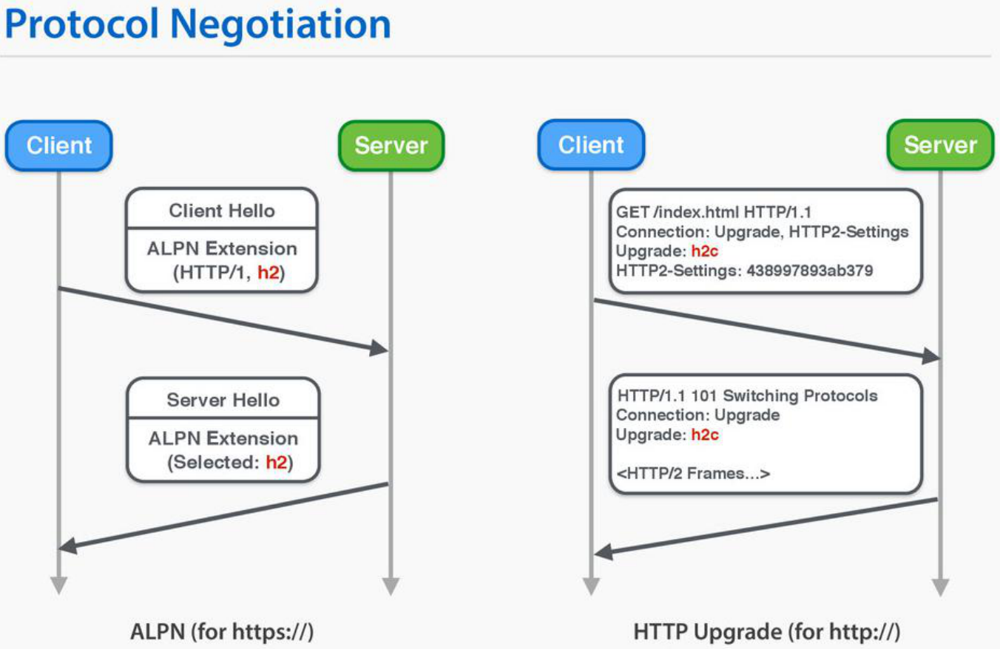
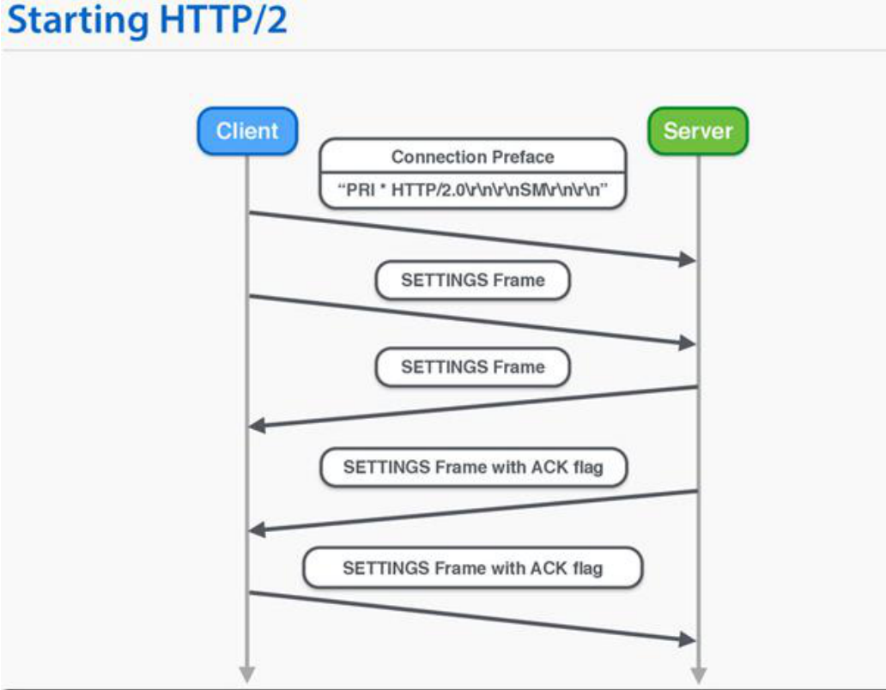

# h2c：在 TCP 上从 HTTP/1 升级到 HTTP/2

h2c is HTTP/2 over TCP.

### HTTP/2 是不是必须基于 TLS/SSL 协议？

* IETF 标准不要求必须基于TLS/SSL协议
* 浏览器要求必须基于TLS/SSL协议
* 在 TLS 层 ALPN (Application Layer Protocol Negotiation) 扩展做协商，只认 HTTP/1.x 的代理服务器不会干扰 HTTP/2
* shema：http:// 和 https:// 默认基于 80 和 443 端口
* h2：基于 TLS 协议运行的 HTTP/2 被称为 h2
* h2c：直接在 TCP 协议之上运行的 HTTP/2 被称为 h2c

### h2 与 h2c

### h2c：不使用 TLS 协议进行协议升级
 
* 客户端测试工具：curl（7.79.1版本）
* curl http://nghttp2.org --http2 -v

### h2c：客户端发送的 Magic 帧

* Preface（ASCII 编码，12字节） 
  - 何时发送？
    - 接收到服务器发送来的 101 Switching Protocols
    - TLS 握手成功后
  - Preface 内容
    - 0x505249202a20485454502f322e300d0a0d0a534d0d0a0d0a
    - PRI * HTTP/2.0\r\n\r\nSM\r\n\r\n
  - 发送完毕后，应紧跟 SETTING 帧

### 统一的连接过程

> 此文章为 2 月 Day9 学习笔记，内容来源于极客时间[《Web 协议详解与抓包实战》](http://gk.link/a/11UWp)，强烈推荐该课程！
